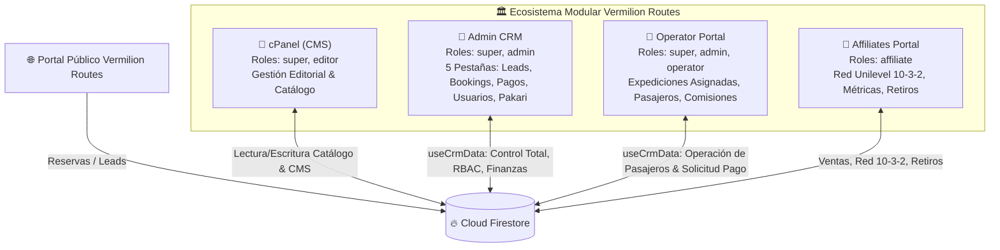
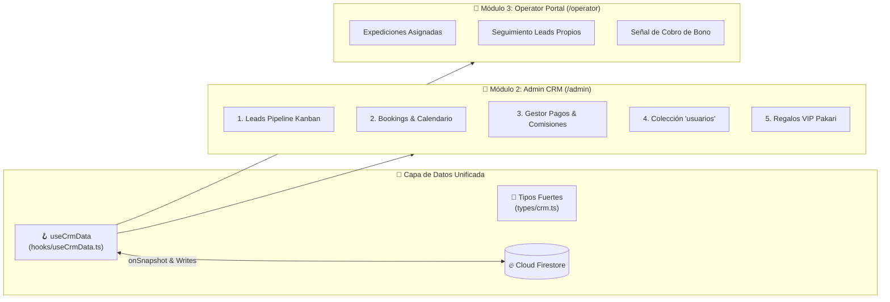

# 🗺️ VERMILION ROUTES — PLANO MAESTRO ARQUITECTÓNICO (ARCHITECTURE MAP)

> **Documento:** `ARCHITECTURE_MAP.md`  
> **Versión:** `1.2.0`  
> **Última Actualización:** 2026-09-03  
> **Responsable:** Arquitecto de Sistemas de Vermilion Routes  
> **Estado:** Activo / Vigente  

---

## 1. Visión General del Ecosistema

El ecosistema **Vermilion Routes** es una plataforma integral de turismo de lujo boutique para Ecuador y las Islas Galápagos. Integra una interfaz pública de alto rendimiento (Next.js App Router, SSR/CSR, diseño editorial premium) con cuatro módulos operativos desacoplados y respaldados por Google Cloud / Firebase Firestore:



### Los 4 Módulos del Sistema

| Módulo | Nombre Operativo | Propósito Principal | Roles Permitidos | Directorio / Archivos Clave |
| :--- | :--- | :--- | :--- | :--- |
| **Módulo 1** | **cPanel (CMS)** | Gestión de contenidos estáticos y dinámicos: catálogo de Tours, Itinerarios día a día, Hero Slider de bienvenida, Destinos, Artículos de Blog, Preguntas Frecuentes (FAQs), testimonios y enlaces de Footer. | `super`, `editor` | [`app/[locale]/cpanel`](file:///c:/Users/pablo/Desktop/clon-vermilion/vermilion/app/[locale]/cpanel) |
| **Módulo 2** | **Admin (CRM & Operaciones Centrales)** | Centro de comando maestro: pipeline de leads VIP, control de bookings con saldos pendientes, aprobación de comisiones (operadores y afiliados), aprovisionamiento de personal en `usuarios`, y asignación de amenidades de lujo Pakari. | `super`, `admin` | [`app/[locale]/admin/page.tsx`](file:///c:/Users/pablo/Desktop/clon-vermilion/vermilion/app/[locale]/admin/page.tsx)<br>[`components/crm/AdminCrmDashboard.tsx`](file:///c:/Users/pablo/Desktop/clon-vermilion/vermilion/components/crm/AdminCrmDashboard.tsx) |
| **Módulo 3** | **Operator (Portal de Expediciones & Pasajeros)** | Panel de trabajo diario para guías naturalistas y concierges: control de expediciones asignadas, seguimiento de leads calificados, contacto directo por WhatsApp/Email, verificación de amenidades VIP y solicitud formal de cobro de honorarios. | `super`, `admin`, `operator` | [`app/[locale]/operator/page.tsx`](file:///c:/Users/pablo/Desktop/clon-vermilion/vermilion/app/[locale]/operator/page.tsx)<br>[`components/crm/OperatorDashboard.tsx`](file:///c:/Users/pablo/Desktop/clon-vermilion/vermilion/components/crm/OperatorDashboard.tsx) |
| **Módulo 4** | **Affiliates (Portal de Embajadores)** | Plataforma de afiliados y embajadores de ventas de ultra-lujo: registro con código de referido único, árbol genealógico unilevel ("10-3-2"), métricas de volumen personal (VP) y grupal (VG), materiales de marketing, liquidación de ganancias y solicitud de retiros bancarios. Protegido bajo el patrón arquitectónico Energyengine con verificación reactiva de sesión y modal blindado de cambio forzado de clave. | `affiliate` | [`app/[locale]/affiliates`](file:///c:/Users/pablo/Desktop/clon-vermilion/vermilion/app/[locale]/affiliates)<br>[`app/[locale]/affiliates/layout.tsx`](file:///c:/Users/pablo/Desktop/clon-vermilion/vermilion/app/[locale]/affiliates/layout.tsx)<br>[`app/[locale]/auth/affiliates/page.tsx`](file:///c:/Users/pablo/Desktop/clon-vermilion/vermilion/app/[locale]/auth/affiliates/page.tsx) |

---

## 2. Matriz de Roles y Permisos (RBAC)

El sistema opera bajo un modelo estricto de control de acceso basado en roles (Role-Based Access Control). Los roles están clasificados en dos niveles de almacenamiento:
1. **Personal Corporativo y Operativo:** Almacenados en la colección [`usuarios`](#31-colección-usuarios) (autenticación vía Firebase Auth + perfil en Firestore; tipado en [`SystemUser`](file:///c:/Users/pablo/Desktop/clon-vermilion/vermilion/types/crm.ts#L3-L18)).
2. **Embajadores de Red:** Almacenados en la colección [`affiliates`](#32-colección-affiliates) (autenticación por username/email con sesión protegida mediante el patrón Energyengine y modal blindado para cambio forzado de contraseña en primer ingreso).

### 2.1 Definición de Roles

* **`super` (Super Administrador):** Máximo nivel de autoridad en la plataforma. Controla código, usuarios, bases de datos, pasarelas de pago, finanzas maestras y autorización de comisiones.
* **`admin` (Administrador Operativo / CRM):** Encargado de la supervisión de bookings, avance del pipeline de leads, asignación de guías y operadores, y validación preliminar de pagos.
* **`operator` (Operador Logístico / Guía / Concierge):** Encargado de la ejecución en campo, atención directa al pasajero, actualización del estatus del viaje y emisión de la señal de liquidación de su comisión.
* **`editor` (Editor de Contenidos / CMS):** Responsable de crear, actualizar y publicar tours, itinerarios, entradas de blog, banners y textos de landing pages sin acceso a datos financieros o CRM de clientes.
* **`affiliate` (Embajador de Marca / Afiliado):** Agente comercial independiente que promueve tours mediante links de tracking y percibe comisiones según el plan de compensación unilevel 10-3-2.

### 2.2 Matriz de Accesos por Módulo y Capacidad

| Recurso / Acción | `super` | `admin` | `operator` | `editor` | `affiliate` |
| :--- | :---: | :---: | :---: | :---: | :---: |
| **Acceso a Módulo cPanel (CMS)** | ✅ Total | ❌ | ❌ | ✅ Solo CMS | ❌ |
| **Acceso a Módulo Admin (CRM Central)** | ✅ Total | ✅ Total | ❌ | ❌ | ❌ |
| **Acceso a Módulo Operator** | ✅ Auditoría | ✅ Supervisión | ✅ Operativo Asignado | ❌ | ❌ |
| **Acceso a Módulo Affiliates Dashboard** | ✅ Auditoría | ✅ Auditoría | ❌ | ❌ | ✅ Exclusivo |
| **Gestión de Personal Interno (`usuarios`)** | ✅ Crear/Modificar/Suspender | ❌ Solo lectura | ❌ | ❌ | ❌ |
| **Gestión de Embajadores (`affiliates`)** | ✅ Total | ✅ Aprobar/Revisar | ❌ | ❌ | ❌ Solo su perfil |
| **Catálogo de Tours & Destinos** | ✅ C/R/U/D | ✅ Lectura | ✅ Lectura | ✅ C/R/U (No D) | ✅ Lectura (links) |
| **Blog, Landing Pages & Footer** | ✅ C/R/U/D | ✅ Lectura | ❌ | ✅ C/R/U | ❌ |
| **Gestión de Bookings (Reservas)** | ✅ C/R/U/D | ✅ C/R/U/D | ✅ R/U (Asignados) | ❌ | ❌ Solo sus ventas |
| **Gestión de Leads Pipeline** | ✅ C/R/U/D | ✅ C/R/U/D | ✅ R/U (Asignados) | ❌ | ❌ |
| **Aprobación de Comisiones & Pagos** | ✅ Autorizar/Liquidar | ✅ Revisar | ❌ Solo solicitar | ❌ | ❌ Solo solicitar |
| **Asignación Regalos VIP Pakari** | ✅ Total | ✅ Asignar | ✅ Ver en ruta | ❌ | ❌ |
| **Configuraciones Globales (`settings`)** | ✅ Modificar | ❌ Solo lectura | ❌ | ❌ | ❌ |
| **Visualización de Métricas Financieras** | ✅ Total P&L | ✅ Volumen/Cobrado | ❌ Honorarios propios | ❌ | ❌ Balance propio |

---

## 3. Esquema de Base de Datos en Cloud Firestore

### 3.1 Colección `usuarios`
> **Ruta:** `/databases/(default)/documents/usuarios/{userEmail}`  
> **Identificador Único (Doc ID):** Correo electrónico normalizado en minúsculas (ej. `pablofgarciaf@gmail.com`).  
> **Definición de Tipos:** [`types/crm.ts`](file:///c:/Users/pablo/Desktop/clon-vermilion/vermilion/types/crm.ts#L1-L18)  
> **Gestión Reactiva:** [`hooks/useCrmData.ts`](file:///c:/Users/pablo/Desktop/clon-vermilion/vermilion/hooks/useCrmData.ts)

Esta colección administra las credenciales, roles y asignaciones del personal interno (Super Admins, Admins, Operadores y Editores).

```typescript
export type UserRole = 'super' | 'admin' | 'operator' | 'editor' | 'affiliate';

export interface SystemUser {
  id: string;                    // Document ID === Correo normalizado (ej. "pablofgarciaf@gmail.com")
  email: string;                 // Correo corporativo para autenticación
  name: string;                  // Nombre completo y cargo
  role: UserRole;                // Rol principal de acceso
  roles?: UserRole[];            // Roles combinados (ej. super tiene todos)
  authUid?: string;              // UID vinculado en Firebase Authentication
  phone?: string;                // Teléfono de contacto / WhatsApp
  cedula?: string;               // Documento de identidad nacional / Pasaporte
  address?: string;              // País o ciudad base
  isActive: boolean;             // Estado de activación en el sistema
  assignedLeadsCount?: number;   // Total de prospectos asignados actualmente
  assignedBookingsCount?: number;// Total de expediciones asignadas actualmente
  createdAt: string;             // Marca temporal ISO-8601
  updatedAt?: string;            // Marca temporal ISO-8601
}
```

#### Usuarios Semilla Iniciales (Provisionados en el Sistema)
1. **`pablofgarciaf@gmail.com`**
   * `name`: `'Pablo Fabricio García Flores'`
   * `role`: `'super'`
   * `roles`: `['super', 'admin', 'operator', 'editor']`
   * `authUid`: `'DmwBje9JwvVJKbe5rr8ExCS823S2'`
   * `phone`: `'+593983992549'` | `cedula`: `'1721790721'`
2. **`info@vermilionroutes.com`**
   * `name`: `'Vermilion Operations Lead'`
   * `role`: `'super'`
   * `roles`: `['super', 'admin', 'operator', 'editor']`
   * `phone`: `'+593994048458'`
3. **`carlos.guia@vermilionroutes.com`**
   * `name`: `'Carlos Mendoza (Senior Naturalist)'`
   * `role`: `'operator'`
   * `roles`: `['operator']`
   * `phone`: `'+593987654321'`
4. **`sofia.sales@vermilionroutes.com`**
   * `name`: `'Sofía Valdivieso (Travel Designer)'`
   * `role`: `'operator'`
   * `roles`: `['operator']`
   * `phone`: `'+593981122334'`

---

### 3.2 Colección `affiliates`
> **Ruta:** `/databases/(default)/documents/affiliates/{username}`  
> **Identificador Único (Doc ID):** Username/referralCode único en minúsculas (ej. `pablo.g`, `juan.perez`).  
> **Mapeo de Código:** [`lib/affiliates.ts`](file:///c:/Users/pablo/Desktop/clon-vermilion/vermilion/lib/affiliates.ts)

```typescript
export interface AffiliateDocument {
  id: string;                    // Document ID === username (lowercase)
  username: string;              // Nombre de usuario único
  email: string;                 // Correo para login en Firebase Auth
  cedula: string;                // Documento de identidad / Pasaporte
  name: string;                  // Nombre completo del embajador
  phone?: string;                // Teléfono WhatsApp de contacto
  address?: string;              // Ciudad / País
  referralCode: string;          // Mismo valor que username
  
  // Jerarquía Unilevel (10-3-2 Limitada)
  parentId: string;              // Username del patrocinador directo (Padre - 3%)
  granId: string;                // Username del patrocinador superior (Abuelo - 2%)
  grandparentId?: string;        // Alias de compatibilidad
  ramaId: number | string;       // Identificador numérico de rama ("1", "1.2")
  rama?: string;                 // Ruta de jerarquía en texto
  rank: 'Standard' | 'Ejecutivo' | 'Premium' | 'Empresario';

  // Saldos Financieros (en USD)
  totalEarnings: number;         // Comisiones históricas acumuladas
  availableBalance: number;      // Saldo disponible para solicitar retiro
  pendingBalance: number;        // Comisiones pendientes de viaje completado

  // Volúmenes de Venta
  salesCount: number;            // Cantidad de bookings concretados
  monthlyVolume: number;         // Volumen Personal (VP) del ciclo actual
  networkVolume: number;         // Volumen Grupal (VG) de la organización
  cumulativePersonalVolume: number; // VP acumulado histórico

  // Banderas de Estado y Seguridad
  isActive: boolean;             // True si cumple con el VP mínimo para bono abuelo
  forcePasswordChange: boolean;  // True si debe resetear contraseña temporal en 1er login
  isEmailVerified: boolean;      // Confirmación de correo
  authUid?: string;              // UID en Firebase Authentication
  
  // Datos Bancarios para Retiros
  bankDetails?: {
    bankName: string;
    accountType: string;
    accountNumber: string;
    holderName: string;
    idNumber: string;
  };

  createdAt: string;             // ISO-8601
  updatedAt?: any;               // Firestore serverTimestamp
}
```

---

### 3.3 Colecciones Operativas y de Negocio

#### A. Colección `bookings` (Reservas, Expediciones y Comisiones)
> **Ruta:** `/databases/(default)/documents/bookings/{bookingId}`  
> **Tipos Unificados:** [`CrmBooking`](file:///c:/Users/pablo/Desktop/clon-vermilion/vermilion/types/crm.ts#L44-L71) en [`types/crm.ts`](file:///c:/Users/pablo/Desktop/clon-vermilion/vermilion/types/crm.ts)  
> **Servicios:** [`hooks/useCrmData.ts`](file:///c:/Users/pablo/Desktop/clon-vermilion/vermilion/hooks/useCrmData.ts) y [`lib/bookings.ts`](file:///c:/Users/pablo/Desktop/clon-vermilion/vermilion/lib/bookings.ts)

```typescript
export type BookingStatus = 
  | 'deposit_pending'       // Depósito pendiente de verificación
  | 'deposit_confirmed'     // Depósito acreditado ($500 USD vía Stripe / transferencia)
  | 'fully_paid'            // Saldo liquidado al 100%
  | 'in_operation'          // Pasajeros en destino bajo coordinación de guía
  | 'completed'             // Expedición finalizada con éxito
  | 'cancelled';            // Reserva anulada

export interface CrmBooking {
  id: string;                    // Firestore Document ID
  bookingCode: string;           // Código de reserva de lujo (ej. "VR-2026-042")
  tourTitle: string;             // Nombre del itinerario boutique contratado
  destination: string;           // Región (Galapagos, Andes, Amazonía, Perú)
  customerName: string;          // Nombre del viajero titular
  customerEmail: string;         // Correo del pasajero
  customerPhone: string;         // Contacto directo / WhatsApp internacional
  passengersCount: number;       // Número de personas en el grupo
  totalAmount: number;           // Valor pactado total en USD
  paidAmount: number;            // Monto efectivamente acreditado hasta la fecha
  status: BookingStatus;         // Estado de la expedición
  travelStartDate: string;       // Fecha de inicio (YYYY-MM-DD)
  travelEndDate: string;         // Fecha de finalización (YYYY-MM-DD)
  
  // Asignación Operativa
  assignedOperatorId?: string;   // Correo del operador/guía asignado
  assignedOperatorName?: string; // Nombre visible del operador
  
  // Liquidación de Comisiones
  affiliateId?: string;          // Código de referido del embajador (ej. "pablo.g")
  affiliateCommissionAmount?: number; // Monto de comisión de afiliado (10%)
  affiliateCommissionStatus?: 'pending' | 'ready_for_review' | 'paid';
  operatorCommissionAmount?: number;  // Honorario pactado del operador local
  operatorCommissionStatus?: 'pending' | 'ready_for_review' | 'paid';
  paymentReference?: string;     // Comprobante bancario o referencia de transferencia
  notes?: string;                // Notas especiales (dietas, vuelos, solicitudes)
  vipGiftAssigned?: string;      // Amenidad Pakari asignada al cliente
  createdAt: string;
  updatedAt: string;
}
```

#### B. Colección `leads` (Pipeline de Prospectos y Ventas)
> **Ruta:** `/databases/(default)/documents/leads/{leadId}`  
> **Tipos Unificados:** [`CrmLead`](file:///c:/Users/pablo/Desktop/clon-vermilion/vermilion/types/crm.ts#L22-L40) en [`types/crm.ts`](file:///c:/Users/pablo/Desktop/clon-vermilion/vermilion/types/crm.ts)

```typescript
export type LeadStatus = 
  | 'new'               // 1. Prospecto recién ingresado
  | 'contacted'         // 2. Primer contacto telefónico / WhatsApp realizado
  | 'itinerary_sent'    // 3. Propuesta de viaje a medida entregada
  | 'negotiation'       // 4. Ajustes de fechas, hoteles y servicios
  | 'won'               // 5. Reserva confirmada y convertida en booking
  | 'lost';             // Descartado

export interface CrmLead {
  id: string;
  customerName: string;
  customerEmail: string;
  customerPhone?: string;
  country?: string;              // País emisor (ej. USA, Francia, Suecia)
  destination: string;           // Destino de interés preferido
  passengersCount: number;       // Cantidad estimada de viajeros
  estimatedBudget: number;       // Presupuesto proyectado en USD
  travelDates?: string;          // Rango de fechas tentativo
  status: LeadStatus;            // Fase del pipeline Kanban
  assignedOperatorId?: string;   // Email del travel designer u operador a cargo
  assignedOperatorName?: string; // Nombre del operador asignado
  notes?: string;                // Bitácora de intereses y requerimientos
  source?: string;               // 'affiliate_referral' | 'landing_popup' | 'contact_form'
  affiliateReferralCode?: string;// Código del embajador que generó la recomendación
  createdAt: string;
  updatedAt: string;
}
```

#### C. Colección `tours` (Catálogo de Experiencias)
> **Ruta:** `/databases/(default)/documents/tours/{tourId}`  
> **Tipos:** [`types/index.ts`](file:///c:/Users/pablo/Desktop/clon-vermilion/vermilion/types/index.ts)

Administra las fichas de producto de lujo: título localizado, precios base y diferenciales por categoría hotelera, itinerarios detallados día por día con traslados y comidas incluidas, galerías de alta definición y ficha técnica descargable en PDF.

#### D. Colección `settings` (Configuración y Textos Globales)
> **Ruta:** `/databases/(default)/documents/settings/{settingDocId}`  
* `settings/global`: Datos oficiales de concierge, WhatsApp comercial y monedas.
* `settings/home`: Contenido del hero slider, banners de llamado a la acción.
* `settings/footer`: Enlaces legales, direcciones corporativas y sellos de calidad.
* `settings/faqs`: Preguntas frecuentes localizadas en inglés, español e italiano.

---

## 4. Arquitectura de Módulos Operativos (CRM Admin & Operator Portal)

El núcleo operativo de Vermilion Routes se encuentra estructurado en dos tableros especializados conectados a una capa de datos reactiva:



### 4.1 Módulo 2: Admin CRM Dashboard (`/admin`)
* **Ruta:** [`app/[locale]/admin/page.tsx`](file:///c:/Users/pablo/Desktop/clon-vermilion/vermilion/app/[locale]/admin/page.tsx)
* **Componente Núcleo:** [`components/crm/AdminCrmDashboard.tsx`](file:///c:/Users/pablo/Desktop/clon-vermilion/vermilion/components/crm/AdminCrmDashboard.tsx)
* **Roles Autorizados:** `super`, `admin`

El Admin CRM es el centro de control financiero y logístico de Vermilion Routes. Cuenta con un encabezado con switchers rápidos hacia cPanel (`/cpanel`) y la vista del Operador (`/operator`), ticker de KPIs financieros en tiempo real (Volumen Reservado, Reservas Activas, Leads en Pipeline, Comisiones por Aprobar) y **5 pestañas operativas**:

1. **Leads Pipeline (CRM):** Tablero visual tipo Kanban estructurado en 5 etapas (`1. Nuevo Lead`, `2. Contactado`, `3. Itinerario Enviado`, `4. En Negociación`, `5. Reserva Confirmada`). Permite reasignar operadores al vuelo, visualizar presupuestos estimados, país emisor y notas del viajero.
2. **Bookings & Calendario (Reservas & Salidas):** Tabla detallada de expediciones. Supervisa el estado de cobro (depósitos parciales vs. saldo 100%), fechas de inicio y término, operador a cargo, comprobantes de pago y asignación de obsequios VIP.
3. **Gestor de Pagos & Aprobación de Comisiones:** Centro de liquidación financiera. Detecta solicitudes marcadas como `ready_for_review` tanto para afiliados (10% de la venta) como para operadores locales (honorarios de campo). Permite al Super Admin abrir el modal de aprobación, ingresar el número de referencia bancaria/transferencia y marcar la comisión como pagada (`paid`).
4. **Gestión de Colección 'usuarios' (Usuarios & Operadores):** Directorio interactivo del personal corporativo. Permite auditar roles (`super`, `admin`, `operator`, `editor`), teléfonos, cédulas y estado de actividad. Incluye un modal reactivo para el aprovisionamiento instantáneo de nuevos operadores en Firestore con validaciones de unicidad.
5. **Regalos VIP Pakari Experience:** Gestor de amenidades de ultra-lujo asignadas a cada reserva de viaje (ej. *Pakari Grand Cru Experience*, *Pakari Imperial Edition & Café de Altura Loja*, *Caja Regalo Premium Pakari 100% Cacao Fino de Aroma*). Asegura la entrega del kit de bienvenida en los hoteles boutique y lodges de Galápagos.

---

### 4.2 Módulo 3: Portal del Operador (`/operator`)
* **Ruta:** [`app/[locale]/operator/page.tsx`](file:///c:/Users/pablo/Desktop/clon-vermilion/vermilion/app/[locale]/operator/page.tsx)
* **Componente Núcleo:** [`components/crm/OperatorDashboard.tsx`](file:///c:/Users/pablo/Desktop/clon-vermilion/vermilion/components/crm/OperatorDashboard.tsx)
* **Roles Autorizados:** `super`, `admin`, `operator`

El Portal del Operador es un entorno de trabajo simplificado y optimizado para guías naturalistas y concierges de campo en Quito, Guayaquil y Galápagos:
* **Filtro Contextual por Operador:** Selector interactivo para alternar la sesión entre operadores (ej. *Carlos Mendoza* o *Sofía Valdivieso*) permitiendo una experiencia de asignación segura.
* **KPIs de Operación Personal:** Total de leads asignados, expediciones activas bajo su tutela y acumulado de bonos/comisiones en USD.
* **Nutrición de Prospectos Asignados:** Posibilidad de contactar al viajero vía WhatsApp o correo y promover el estatus del prospecto directamente.
* **Control de Expedición en Curso:** Consulta de fechas de vuelo, cantidad de pasajeros, notas dietarias y regalo VIP asignado al pasajero.
* **Señal de Viaje Completado:** Botón *"Señalar Viaje Realizado & Solicitar Pago"*, que ejecuta la función `signalCommissionReady` para colocar la comisión en estado `ready_for_review` en el tablero del Super Admin.

---

### 4.3 Capa de Datos Reactiva y Tipado Fuerte

#### A. Hook Unificado `useCrmData`
* **Archivo:** [`hooks/useCrmData.ts`](file:///c:/Users/pablo/Desktop/clon-vermilion/vermilion/hooks/useCrmData.ts)
* **Propósito:** Centraliza la suscripción en tiempo real a las colecciones de Firestore (`usuarios`, `leads`, `bookings`) mediante `onSnapshot`, con espejo local inmediato (fallback optimista) para garantizar operatividad instantánea.
* **Métodos Expuestos:**
  * `createUser(newUser)`: Inserta o actualiza un documento en `/usuarios/{email}`.
  * `updateLeadStatus(leadId, status, assignedOperator)`: Actualiza la fase de un prospecto y opcionalmente reasigna su operador.
  * `updateBookingStatus(bookingId, status)`: Cambia el estado de una expedición turística.
  * `approveAndPayCommission(bookingId, type, reference)`: Registra la transacción de pago de comisión y pasa el estado a `paid`.
  * `signalCommissionReady(bookingId, type)`: Emite la solicitud de cobro del operador/afiliado (`ready_for_review`).
  * `assignVipGift(bookingId, giftName)`: Asocia una amenidad Pakari a la reserva.

#### B. Tipos de Datos Compartidos
* **Archivo:** [`types/crm.ts`](file:///c:/Users/pablo/Desktop/clon-vermilion/vermilion/types/crm.ts)
* Define de manera estricta los contratos de datos: [`SystemUser`](file:///c:/Users/pablo/Desktop/clon-vermilion/vermilion/types/crm.ts#L3-L18), [`CrmLead`](file:///c:/Users/pablo/Desktop/clon-vermilion/vermilion/types/crm.ts#L22-L40), [`CrmBooking`](file:///c:/Users/pablo/Desktop/clon-vermilion/vermilion/types/crm.ts#L44-L71), [`CommissionPayoutRequest`](file:///c:/Users/pablo/Desktop/clon-vermilion/vermilion/types/crm.ts#L73-L86), [`UserRole`](file:///c:/Users/pablo/Desktop/clon-vermilion/vermilion/types/crm.ts#L1), [`LeadStatus`](file:///c:/Users/pablo/Desktop/clon-vermilion/vermilion/types/crm.ts#L20) y [`BookingStatus`](file:///c:/Users/pablo/Desktop/clon-vermilion/vermilion/types/crm.ts#L42).

---

### 4.4 Módulo 4: Portal de Embajadores & Flujo de Autenticación Blindado (Patrón Energyengine)

El portal de embajadores implementa el **patrón de autenticación y protección blindada probado en Energyengine**, garantizando la seguridad en el ciclo de vida del usuario desde su onboarding con credenciales temporales (cédula) hasta el aprovisionamiento de su clave definitiva y acceso a las métricas del plan unilevel 10-3-2.

```mermaid
flowchart TD
    User([Visitante / Embajador]) --> RouteCheck{Ruta solicitada}
    
    RouteCheck -->|/[locale]/auth| CanonicalRedirect["Redirección Canónica\n(app/[locale]/auth/page.tsx)"] --> AuthPage
    RouteCheck -->|/[locale]/auth/affiliates| AuthPage["Página Oficial de Autenticación\n(app/[locale]/auth/affiliates/page.tsx)\nTabs: Login | Registro | Recuperar"]
    RouteCheck -->|/[locale]/affiliates/*| LayoutGuard{"Guard en Layout Privado\n(app/[locale]/affiliates/layout.tsx)"}
    
    LayoutGuard -->|Rutas públicas (presentation, verify)| PublicAccess[Renderizar Contenido Público]
    LayoutGuard -->|onAuthStateChanged| SessionCheck{¿Sesión activa?}
    
    SessionCheck -->|No autenticado| RedirectToAuth["router.replace(/auth/affiliates)"]
    SessionCheck -->|Autenticado| ForcePwdCheck{¿forcePasswordChange == true?}
    
    ForcePwdCheck -->|Sí| RedirectToAuth
    ForcePwdCheck -->|No| DashboardAccess["Acceso Concedido:\nSidebar + Dashboard (/affiliates/*)"]
    
    subgraph OnboardingFlow ["🔐 Ciclo de Vida: Registro & Blindaje de Clave"]
        AuthPage -->|Tab Registro: Correo 1ero -> Sugiere Usuario| DoRegister["1. createUserWithEmailAndPassword\n(Clave provisional = Cédula)\n2. sendEmailVerification\n(Sesión Activa en memoria)\n3. registerAffiliateInFirestore"]
        DoRegister --> TriggerModal["Abre ForcePasswordChangeModal\n(Sesión activa inmediata)"]
        
        AuthPage -->|Tab Login con Email o @Username| DoLogin["signInWithEmailAndPassword\n(Resuelve @user a email si es necesario)"]
        DoLogin --> CheckLoginStatus{¿forcePasswordChange?}
        CheckLoginStatus -->|Sí| TriggerModal
        CheckLoginStatus -->|No| DashboardAccess
        
        TriggerModal --> ModalAction["ForcePasswordChangeModal\n• Fallback signIn si la sesión cayó\n• Re-autenticación ante token expirado\n• updatePassword en Firebase Auth\n• updateDoc(forcePasswordChange: false)"]
        ModalAction -->|Éxito| DashboardAccess
    end
```

#### 1. Adopción del Flujo de Protección Energyengine en `app/[locale]/affiliates/layout.tsx`
* **Archivo:** [`app/[locale]/affiliates/layout.tsx`](file:///c:/Users/pablo/Desktop/clon-vermilion/vermilion/app/[locale]/affiliates/layout.tsx)
* **Comportamiento del Guard Reactivo:**
  * Intercepta la navegación hacia cualquier subruta de `/affiliates` (`/dashboard`, `/earnings`, `/network`, `/withdrawals`, `/profile`, `/resources`).
  * **Excepciones Públicas:** Permite el acceso sin autenticación estricta a rutas de difusión y verificación: `/${locale}/affiliates/presentation`, `/${locale}/affiliates/verify` y `/${locale}/presentation`.
  * **Verificación de Sesión (`onAuthStateChanged`):**
    * Si no hay sesión activa en Firebase Auth: ejecuta `router.replace('/[locale]/auth/affiliates')`.
    * Si la sesión existe, consulta el documento en Firestore mediante `getAffiliateByEmail(firebaseUser.email)`. Si la bandera `forcePasswordChange` es `true`, redirige de inmediato a `/[locale]/auth/affiliates` impidiendo la visualización del panel hasta que el embajador defina su clave definitiva.
    * Si el usuario está autenticado y verificado (`forcePasswordChange === false`): inicializa el estado `currentUser` y despliega la interfaz con [`AffiliatesSidebar`](file:///c:/Users/pablo/Desktop/clon-vermilion/vermilion/components/affiliates/AffiliatesSidebar.tsx).

#### 2. Página Oficial de Autenticación de Embajadores en `app/[locale]/auth/affiliates/page.tsx`
* **Archivo:** [`app/[locale]/auth/affiliates/page.tsx`](file:///c:/Users/pablo/Desktop/clon-vermilion/vermilion/app/[locale]/auth/affiliates/page.tsx)
* **Unificación de Flujo:** Concentra en un único punto de entrada las tres operaciones críticas del embajador:
  1. **Inicio de Sesión (`login`):** Admite ingreso indistinto por correo electrónico registrado o por nombre de usuario (`@username`). En caso de identificador de usuario, consulta Firestore vía [`getAffiliateByUsername`](file:///c:/Users/pablo/Desktop/clon-vermilion/vermilion/lib/affiliates.ts) para resolver el correo antes de invocar `signInWithEmailAndPassword`.
  2. **Registro de Cuentas (`register`):**
     * **Orden de campos optimizado:** Se solicita primero el **Correo Electrónico** (`regEmail`) antes del nombre de usuario. Esto evita la apertura prematura de modales o validaciones erróneas que interrumpían el llenado del formulario.
     * **Auto-sugerencia de Usuario Único:** Al ingresar el correo, el handler `handleEmailChange` extrae el prefijo antes del `@`, lo sanitiza en minúsculas alfanuméricas y sugiere el `@username` (`regUsername`), consultando inmediatamente su disponibilidad en tiempo real con `isUsernameAvailable`.
     * **Persistencia de Sesión Activa Post-Registro:** El registro invoca `createUserWithEmailAndPassword(auth, cleanEmail, cleanCedula)` asignando la cédula como contraseña provisional y despacha `sendEmailVerification` **sin cerrar la sesión**. De esta manera, el usuario permanece logueado en memoria y el modal de cambio obligatorio de clave se abre de forma transparente y sin fricción.
  3. **Recuperación de Contraseña (`forgot`):** Envía un enlace seguro de restablecimiento vía `sendPasswordResetEmail(auth, targetEmail)`.

#### 3. Blindaje de Seguridad en `components/auth/ForcePasswordChangeModal.tsx`
* **Archivo:** [`components/auth/ForcePasswordChangeModal.tsx`](file:///c:/Users/pablo/Desktop/clon-vermilion/vermilion/components/auth/ForcePasswordChangeModal.tsx)
* **Resolución del Error *"Sesión no encontrada"*:**
  * Si la sesión en memoria se ha desconectado o el usuario recargó la ventana (`!auth?.currentUser`), el modal implementa un **fallback automático**: recupera el correo electrónico o username del afiliado y ejecuta `signInWithEmailAndPassword(auth, targetEmail, currentPassword.trim())` utilizando la cédula ingresada en el campo *"Contraseña Actual (Tu Cédula)"*.
  * Si Firebase Auth exige una re-autenticación reciente (`auth/requires-recent-login`), el modal genera una credencial con `EmailAuthProvider.credential(targetUser.email, currentPassword.trim())` y llama a `reauthenticateWithCredential(targetUser, credential)` antes de ejecutar `updatePassword`.
* **Sincronización Dual en Firestore:** Al actualizar exitosamente la contraseña, remueve la bandera `forcePasswordChange: false` y actualiza la marca temporal `updatedAt` tanto en la colección `affiliates/{id}` como en `usuarios/{email}` (si existe cuenta de personal asociada).

#### 4. Redirección Canónica en `app/[locale]/auth/page.tsx`
* **Archivo:** [`app/[locale]/auth/page.tsx`](file:///c:/Users/pablo/Desktop/clon-vermilion/vermilion/app/[locale]/auth/page.tsx)
* Centraliza el tráfico genérico de autenticación redirigiendo de manera directa e incondicional hacia `/[locale]/auth/affiliates` preservando la configuración de idioma (`locale`).

---

## 5. Rutas en Next.js (Inventario y Módulos)

El proyecto utiliza **Next.js App Router** con soporte multi-idioma a través de `next-intl` (`/[locale]/...`), soportando `en`, `es` e `it`.

```
vermilion/app/
│
├── [locale]/
│   ├── admin/page.tsx           ← Módulo 2: Admin CRM Dashboard (5 Pestañas)
│   ├── operator/page.tsx        ← Módulo 3: Portal del Operador (Expediciones y Comisiones)
│   ├── cpanel/                  ← Módulo 1: CMS Editorial & Catálogo de Tours
│   │   ├── page.tsx             ← Dashboard de CMS y Contenidos
│   │   └── login/page.tsx       ← Redirección de autenticación
│   │
│   ├── affiliates/              ← Módulo 4: Embajadores de Venta
│   │   ├── layout.tsx           ← Guard de Autenticación & Layout Privado (Patrón Energyengine)
│   │   ├── page.tsx             ← Redirección automática a /affiliates/dashboard
│   │   ├── dashboard/page.tsx   ← Resumen de métricas y comisiones
│   │   ├── earnings/page.tsx    ← Desglose de ingresos
│   │   ├── network/page.tsx     ← Visualización de red genealógica unilevel
│   │   ├── presentation/page.tsx← Diapositivas comerciales (Pública)
│   │   ├── profile/page.tsx     ← Perfil y datos bancarios
│   │   ├── resources/page.tsx   ← Enlaces y material promocional
│   │   └── withdrawals/page.tsx ← Solicitud de desembolsos
│   │
│   ├── auth/                    ← Autenticación de Embajadores & Personal
│   │   ├── page.tsx             ← Redirección canónica a /auth/affiliates
│   │   └── affiliates/page.tsx  ← Portal oficial de autenticación unificada (Login/Registro/Forgot)
│   ├── blog/                    ← Artículos editoriales
│   ├── booking/page.tsx         ← Formulario de reserva de tours
│   ├── checkout/payment/page.tsx← Pasarela de pago de reservas
│   ├── tours/                   ← Catálogo público
│   │   ├── page.tsx             ← Explorador de tours
│   │   └── [id]/page.tsx        ← Ficha de expedición boutique
│   └── page.tsx                 ← Landing page principal
│
└── api/                         ← Route Handlers Serverless
    ├── auth/send-verification/  ← Envío de tokens de verificación
    ├── auth/verify-token/       ← Validación de autenticación
    ├── checkout/session/        ← Sesión de Stripe checkout
    ├── concierge/chat/          ← Concierge virtual asistido por IA
    ├── leads/                   ← Ingesta de prospectos generales
    ├── leads/magnet/            ← Descarga de catálogo con captura de lead
    └── leads/newsletter/        ← Suscripción a novedades
```

### 5.1 Inventario Detallado de Rutas

| Ruta (URL Relativa) | Tipo | Módulo | Roles Requeridos | Estado Actual | Archivo Fuente |
| :--- | :--- | :--- | :--- | :--- | :--- |
| `/[locale]` | Página (SSR) | Público | Público | ✅ Activa | [`app/[locale]/page.tsx`](file:///c:/Users/pablo/Desktop/clon-vermilion/vermilion/app/[locale]/page.tsx) |
| `/[locale]/tours` | Página (CSR/SSR) | Público | Público | ✅ Activa | [`app/[locale]/tours/page.tsx`](file:///c:/Users/pablo/Desktop/clon-vermilion/vermilion/app/[locale]/tours/page.tsx) |
| `/[locale]/tours/[id]` | Página (CSR/SSR) | Público | Público | ✅ Activa | [`app/[locale]/tours/[id]/page.tsx`](file:///c:/Users/pablo/Desktop/clon-vermilion/vermilion/app/[locale]/tours/page.tsx) |
| `/[locale]/blog` | Página (SSR) | Público | Público | ✅ Activa | [`app/[locale]/blog/page.tsx`](file:///c:/Users/pablo/Desktop/clon-vermilion/vermilion/app/[locale]/blog/page.tsx) |
| `/[locale]/blog/[slug]` | Página (SSR) | Público | Público | ✅ Activa | [`app/[locale]/blog/[slug]/page.tsx`](file:///c:/Users/pablo/Desktop/clon-vermilion/vermilion/app/[locale]/blog/[slug]/page.tsx) |
| `/[locale]/booking` | Página (CSR) | Público | Público | ✅ Activa | [`app/[locale]/booking/page.tsx`](file:///c:/Users/pablo/Desktop/clon-vermilion/vermilion/app/[locale]/booking/page.tsx) |
| `/[locale]/checkout/payment` | Página (CSR) | Público | Público | ✅ Activa | [`app/[locale]/checkout/payment/page.tsx`](file:///c:/Users/pablo/Desktop/clon-vermilion/vermilion/app/[locale]/checkout/payment/page.tsx) |
| `/[locale]/auth` | Página (CSR) | Autenticación | Público | ✅ Activa (Redirige a `/auth/affiliates`) | [`app/[locale]/auth/page.tsx`](file:///c:/Users/pablo/Desktop/clon-vermilion/vermilion/app/[locale]/auth/page.tsx) |
| `/[locale]/auth/affiliates` | Página (CSR) | **Affiliates Auth** | Público | ✅ Activa (Portal Oficial Login/Registro) | [`app/[locale]/auth/affiliates/page.tsx`](file:///c:/Users/pablo/Desktop/clon-vermilion/vermilion/app/[locale]/auth/affiliates/page.tsx) |
| `/[locale]/cpanel` | Página (CSR) | **cPanel (CMS)** | `super`, `editor` | ✅ Activa | [`app/[locale]/cpanel/page.tsx`](file:///c:/Users/pablo/Desktop/clon-vermilion/vermilion/app/[locale]/cpanel/page.tsx) |
| `/[locale]/admin` | Página (CSR) | **Admin (CRM)** | `super`, `admin` | ✅ Activa | [`app/[locale]/admin/page.tsx`](file:///c:/Users/pablo/Desktop/clon-vermilion/vermilion/app/[locale]/admin/page.tsx)<br>[`components/crm/AdminCrmDashboard.tsx`](file:///c:/Users/pablo/Desktop/clon-vermilion/vermilion/components/crm/AdminCrmDashboard.tsx) |
| `/[locale]/operator` | Página (CSR) | **Operator** | `super`, `admin`, `operator` | ✅ Activa | [`app/[locale]/operator/page.tsx`](file:///c:/Users/pablo/Desktop/clon-vermilion/vermilion/app/[locale]/operator/page.tsx)<br>[`components/crm/OperatorDashboard.tsx`](file:///c:/Users/pablo/Desktop/clon-vermilion/vermilion/components/crm/OperatorDashboard.tsx) |
| `/[locale]/affiliates` | Página (CSR) | **Affiliates** | Público / `affiliate` | ✅ Activa (Guard Energyengine -> Dashboard) | [`app/[locale]/affiliates/page.tsx`](file:///c:/Users/pablo/Desktop/clon-vermilion/vermilion/app/[locale]/affiliates/page.tsx)<br>[`app/[locale]/affiliates/layout.tsx`](file:///c:/Users/pablo/Desktop/clon-vermilion/vermilion/app/[locale]/affiliates/layout.tsx) |
| `/[locale]/affiliates/dashboard` | Página (CSR) | **Affiliates** | `affiliate` | ✅ Activa | [`app/[locale]/affiliates/dashboard/page.tsx`](file:///c:/Users/pablo/Desktop/clon-vermilion/vermilion/app/[locale]/affiliates/dashboard/page.tsx) |
| `/[locale]/affiliates/earnings` | Página (CSR) | **Affiliates** | `affiliate` | ✅ Activa | [`app/[locale]/affiliates/earnings/page.tsx`](file:///c:/Users/pablo/Desktop/clon-vermilion/vermilion/app/[locale]/affiliates/earnings/page.tsx) |
| `/[locale]/affiliates/network` | Página (CSR) | **Affiliates** | `affiliate` | ✅ Activa | [`app/[locale]/affiliates/network/page.tsx`](file:///c:/Users/pablo/Desktop/clon-vermilion/vermilion/app/[locale]/affiliates/network/page.tsx) |
| `/[locale]/affiliates/withdrawals`| Página (CSR) | **Affiliates** | `affiliate` | ✅ Activa | [`app/[locale]/affiliates/withdrawals/page.tsx`](file:///c:/Users/pablo/Desktop/clon-vermilion/vermilion/app/[locale]/affiliates/withdrawals/page.tsx) |
| `/[locale]/affiliates/resources` | Página (CSR) | **Affiliates** | `affiliate` | ✅ Activa | [`app/[locale]/affiliates/resources/page.tsx`](file:///c:/Users/pablo/Desktop/clon-vermilion/vermilion/app/[locale]/affiliates/resources/page.tsx) |
| `/[locale]/affiliates/profile` | Página (CSR) | **Affiliates** | `affiliate` | ✅ Activa | [`app/[locale]/affiliates/profile/page.tsx`](file:///c:/Users/pablo/Desktop/clon-vermilion/vermilion/app/[locale]/affiliates/profile/page.tsx) |
| `/api/leads` | API Route | Lead Capture | Público | ✅ Activa | [`app/api/leads/route.ts`](file:///c:/Users/pablo/Desktop/clon-vermilion/vermilion/app/api/leads/route.ts) |
| `/api/leads/magnet` | API Route | Lead Capture | Público | ✅ Activa | [`app/api/leads/magnet/route.ts`](file:///c:/Users/pablo/Desktop/clon-vermilion/vermilion/app/api/leads/magnet/route.ts) |
| `/api/leads/newsletter` | API Route | Lead Capture | Público | ✅ Activa | [`app/api/leads/newsletter/route.ts`](file:///c:/Users/pablo/Desktop/clon-vermilion/vermilion/app/api/leads/newsletter/route.ts) |
| `/api/checkout/session` | API Route | Pagos | Público | ✅ Activa | [`app/api/checkout/session/route.ts`](file:///c:/Users/pablo/Desktop/clon-vermilion/vermilion/app/api/checkout/session/route.ts) |
| `/api/concierge/chat` | API Route | AI Concierge | Público | ✅ Activa | [`app/api/concierge/chat/route.ts`](file:///c:/Users/pablo/Desktop/clon-vermilion/vermilion/app/api/concierge/chat/route.ts) |

---

## 6. Reglas de Negocio de Compensación y Comisiones

Vermilion Routes implementa un modelo de comisiones de dos vertientes:

### 6.1 Plan de Embajadores ("10-3-2 Limitada" + Piscinas Globales)
* **Vendedor Directo (Nivel 0):** **10%** del valor del paquete turístico vendido, ilimitado e incondicional.
* **Patrocinador Directo / Padre (Nivel 1):** **3%** de la venta de su hijo hasta un volumen acumulado de $10,000 USD por hijo (tope de $300 USD por cada línea).
* **Patrocinador Superior / Abuelo (Nivel 2):** **2%** de la venta del nieto, con dos tramos:
  * Primeros $1,000 USD de venta: incondicional (tope $20 USD).
  * Hasta $5,000 USD: requiere que el abuelo mantenga estado **Activo** (Volumen Personal $\ge$ $1,000 USD en el periodo).
* **Compresión Inversa & Remanente:** Si un patrocinador no califica, la comisión se comprime hacia el siguiente nodo elegible o retorna al Founder (`pablo.g`).
* **Piscinas Globales:** 6% adicional dividido en tres piscinas de 2% (Negocio, Líder y Premium) asignadas por metas de volumen grupal.

### 6.2 Comisiones de Operador Logístico (Concierge / Operator)
* Los operadores perciben una compensación por expedición asignada.
* **Flujo de Liquidación:**
  1. Al iniciar la expedición, el estatus de la comisión es `pending`.
  2. Al culminar el itinerario, el operador presiona *"Señalar Viaje Realizado"* en su portal (`/operator`), cambiando el estatus a `ready_for_review`.
  3. El Super Admin revisa la solicitud en la pestaña *Aprobación de Pagos & Comisiones* del Admin CRM (`/admin`), registra la referencia bancaria y confirma el desembolso (`paid`).

---

## 7. Bitácora de Evolución del Plano (Changelog)

| Fecha | Versión | Autor | Cambios Implementados | Próximos Pasos / Hitos |
| :--- | :---: | :--- | :--- | :--- |
| **2026-09-03** | `v1.2.0` | **Arquitecto de Sistemas** | • **Adopción del Flujo de Protección Energyengine en Affiliates:** Implementación en [`app/[locale]/affiliates/layout.tsx`](file:///c:/Users/pablo/Desktop/clon-vermilion/vermilion/app/[locale]/affiliates/layout.tsx) con verificación reactiva de sesión (`onAuthStateChanged`) y redirección inmediata a `/auth/affiliates` en caso de no contar con sesión activa o si `forcePasswordChange === true`. Acceso al dashboard y sidebar únicamente para cuentas verificadas.<br>• **Portal Oficial de Autenticación de Embajadores:** Creación de [`app/[locale]/auth/affiliates/page.tsx`](file:///c:/Users/pablo/Desktop/clon-vermilion/vermilion/app/[locale]/auth/affiliates/page.tsx) con interfaz unificada por pestañas (`login`, `register`, `forgot`), soporte de inicio de sesión dual (correo o `@username`), orden de campos optimizado en registro (correo electrónico primero para prevenir la apertura prematura de modales) y auto-sugerencia en tiempo real de `@username` con comprobación de disponibilidad en Firestore.<br>• **Persistencia de Sesión Activa Post-Registro:** El registro en Firebase Auth (`createUserWithEmailAndPassword` + `sendEmailVerification`) mantiene la sesión activa en memoria, permitiendo el despliegue inmediato del modal de primer cambio de clave sin deslogueo.<br>• **Blindaje de Cambio Obligatorio de Clave:** Refactorización de [`components/auth/ForcePasswordChangeModal.tsx`](file:///c:/Users/pablo/Desktop/clon-vermilion/vermilion/components/auth/ForcePasswordChangeModal.tsx) incorporando fallback automático de re-autenticación por cédula si la sesión se cae (eliminando de raíz el error *"Sesión no encontrada"*), re-autenticación ante expiración de token y sincronización atómica de `forcePasswordChange: false` en Firestore (`affiliates` y `usuarios`).<br>• **Redirección Canónica de Autenticación:** Configuración en [`app/[locale]/auth/page.tsx`](file:///c:/Users/pablo/Desktop/clon-vermilion/vermilion/app/[locale]/auth/page.tsx) para canalizar todo el tráfico genérico de `/auth` directamente a `/auth/affiliates`.<br>• Actualización del plano arquitectónico maestro, inventario de rutas de Next.js y diagramas de flujo. | 1. Implementar reglas de seguridad en `firestore.rules` específicas para las colecciones `usuarios` y campos de pago de `bookings`.<br>2. Conectar notificaciones automáticas vía WhatsApp (Twilio/Meta Cloud API) para alertas de leads a operadores.<br>3. Integrar generación automatizada de vouchers de regalo VIP Pakari en formato PDF. |
| **2026-09-02** | `v1.1.0` | **Arquitecto de Sistemas** | • **Implementación del Módulo 2 (Admin CRM):** Creación de [`app/[locale]/admin/page.tsx`](file:///c:/Users/pablo/Desktop/clon-vermilion/vermilion/app/[locale]/admin/page.tsx) y [`components/crm/AdminCrmDashboard.tsx`](file:///c:/Users/pablo/Desktop/clon-vermilion/vermilion/components/crm/AdminCrmDashboard.tsx) con 5 pestañas operativas (Leads Pipeline Kanban, Bookings & Calendario, Gestor de Pagos/Comisiones, Colección 'usuarios' con modal de creación reactiva, y Regalos VIP Pakari Experience).<br>• **Implementación del Módulo 3 (Operator Portal):** Creación de [`app/[locale]/operator/page.tsx`](file:///c:/Users/pablo/Desktop/clon-vermilion/vermilion/app/[locale]/operator/page.tsx) y [`components/crm/OperatorDashboard.tsx`](file:///c:/Users/pablo/Desktop/clon-vermilion/vermilion/components/crm/OperatorDashboard.tsx) con filtro de operador, control de pasajeros y flujo de solicitud de pago de comisiones.<br>• **Capa de Datos Reactiva:** Creación de [`hooks/useCrmData.ts`](file:///c:/Users/pablo/Desktop/clon-vermilion/vermilion/hooks/useCrmData.ts) y tipado estricto en [`types/crm.ts`](file:///c:/Users/pablo/Desktop/clon-vermilion/vermilion/types/crm.ts).<br>• Actualización integral de la matriz de rutas e inventario del sistema. | 1. Implementar reglas de seguridad en `firestore.rules` específicas para las colecciones `usuarios` y campos de pago de `bookings`.<br>2. Conectar notificaciones automáticas vía WhatsApp (Twilio/Meta Cloud API) para alertas de leads a operadores.<br>3. Integrar generación automatizada de vouchers de regalo VIP Pakari en formato PDF. |
| **2026-09-02** | `v1.0.0` | **Arquitecto de Sistemas** | Creación inicial del plano arquitectónico maestro `ARCHITECTURE_MAP.md`. Especificación de los 4 módulos (cPanel, Admin CRM, Operator, Affiliates). Matriz de roles y permisos RBAC (`super`, `admin`, `operator`, `editor`, `affiliate`). Especificación detallada de la colección `usuarios` y `affiliates`. Mapeo completo de colecciones operativas y rutas de Next.js. | 1. Implementar la colección `usuarios` en Firestore y actualizar `firestore.rules`.<br>2. Escindir físicamente las vistas de `cPanel` (CMS) y `Admin` (CRM/Finanzas).<br>3. Diseñar las vistas del portal `operator`. |
