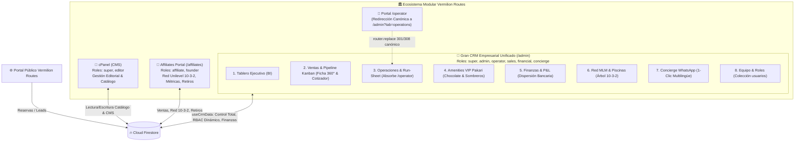
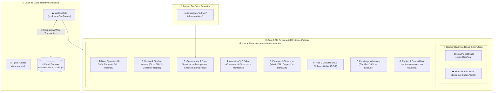

# 🗺️ VERMILION ROUTES — PLANO MAESTRO ARQUITECTÓNICO (ARCHITECTURE MAP)

> **Documento:** `ARCHITECTURE_MAP.md`  
> **Versión:** `1.4.0`  
> **Última Actualización:** 2026-09-03  
> **Responsable:** Arquitecto de Sistemas de Vermilion Routes  
> **Estado:** Activo / Vigente  

---

## 1. Visión General del Ecosistema

El ecosistema **Vermilion Routes** es una plataforma integral de turismo de lujo boutique para Ecuador y las Islas Galápagos. Integra una interfaz pública de alto rendimiento (Next.js App Router, SSR/CSR, diseño editorial premium) con módulos operativos consolidados y respaldados por Google Cloud / Firebase Firestore:



### Los Módulos del Sistema

| Módulo | Nombre Operativo | Propósito Principal | Roles Permitidos | Directorio / Archivos Clave |
| :--- | :--- | :--- | :--- | :--- |
| **Módulo 1** | **cPanel (CMS)** | Gestión de contenidos estáticos y dinámicos: catálogo de Tours, Itinerarios día a día, Hero Slider de bienvenida, Destinos, Artículos de Blog, Preguntas Frecuentes (FAQs), testimonios y enlaces de Footer. | `super`, `editor` | [`app/[locale]/cpanel/page.tsx`](file:///c:/Users/pablo/Desktop/clon-vermilion/vermilion/app/[locale]/cpanel/page.tsx)<br>[`components/admin/AdminLoginForm.tsx`](file:///c:/Users/pablo/Desktop/clon-vermilion/vermilion/components/admin/AdminLoginForm.tsx) (Validación estricta en `usuarios`) |
| **Módulo 2** | **Admin (Gran CRM Empresarial Unificado)** | Centro de comando maestro y torre de control de las 8 áreas operativas de la compañía (BI, Ventas, Operaciones, Pakari, Finanzas, Red MLM, WhatsApp Concierge y Directorio de Personal). Incorpora Sidebar Dinámico RBAC y simulador de roles para Super Admin. | `super`, `admin`, `operator`, `sales`, `financial`, `concierge`, `editor` | [`app/[locale]/admin/layout.tsx`](file:///c:/Users/pablo/Desktop/clon-vermilion/vermilion/app/[locale]/admin/layout.tsx) (Layout Guard Corporativo 403)<br>[`app/[locale]/admin/page.tsx`](file:///c:/Users/pablo/Desktop/clon-vermilion/vermilion/app/[locale]/admin/page.tsx)<br>[`components/crm/AdminCrmDashboard.tsx`](file:///c:/Users/pablo/Desktop/clon-vermilion/vermilion/components/crm/AdminCrmDashboard.tsx) |
| **Módulo 3** | **Operator (Redirección Canónica & Alias de Campo)** | Punto de entrada unificado para guías naturalistas y operadores de campo: redirige de forma canónica hacia la pestaña *Operaciones & Run-Sheet* del Gran CRM Empresarial (`/[locale]/admin?tab=operations`), preservando compatibilidad y control de acceso. | `super`, `admin`, `operator` | [`app/[locale]/operator/layout.tsx`](file:///c:/Users/pablo/Desktop/clon-vermilion/vermilion/app/[locale]/operator/layout.tsx) (Layout Guard 403 Forbidden)<br>[`app/[locale]/operator/page.tsx`](file:///c:/Users/pablo/Desktop/clon-vermilion/vermilion/app/[locale]/operator/page.tsx) (`router.replace` canónico) |
| **Módulo 4** | **Affiliates (Portal de Embajadores)** | Plataforma de afiliados y embajadores de ventas de ultra-lujo: registro con código de referido único, árbol genealógico unilevel ("10-3-2"), métricas de volumen personal (VP) y grupal (VG), materiales de marketing, liquidación de ganancias y solicitud de retiros bancarios. Protegido bajo el patrón arquitectónico Energyengine con verificación reactiva de sesión, blindaje anti-adulteración de rol y modal de cambio forzado de clave. | `affiliate`, `founder` | [`app/[locale]/affiliates/layout.tsx`](file:///c:/Users/pablo/Desktop/clon-vermilion/vermilion/app/[locale]/affiliates/layout.tsx) (Guard Anti-Adulteración & Status)<br>[`app/[locale]/auth/affiliates/page.tsx`](file:///c:/Users/pablo/Desktop/clon-vermilion/vermilion/app/[locale]/auth/affiliates/page.tsx) (Alertas Rojas 403) |

---

## 2. Matriz de Roles y Permisos (RBAC)

El sistema opera bajo un modelo estricto de control de acceso basado en roles (Role-Based Access Control) con tipado exhaustivo en `UserRole`. Los roles están clasificados en dos niveles de almacenamiento:
1. **Personal Corporativo y Departamental:** Almacenados en la colección [`usuarios`](#31-colección-usuarios) (autenticación vía Firebase Auth + perfil en Firestore; tipado en [`SystemUser`](file:///c:/Users/pablo/Desktop/clon-vermilion/vermilion/types/crm.ts#L11-L26)).
2. **Embajadores de Red Comercial:** Almacenados en la colección [`affiliates`](#32-colección-affiliates) (autenticación por username/email con sesión protegida mediante el patrón Energyengine y modal blindado para cambio forzado de contraseña en primer ingreso).

### 2.1 Definición de Roles

* **`super` (Super Administrador):** Máximo nivel de autoridad institucional y técnica. Posee acceso y visibilidad irrestricta sobre las **8 áreas completas de la empresa**, cPanel (CMS), bases de datos, finanzas maestras y autorización de desembolsos. Cuenta en exclusiva con el **Selector de Simulación de Roles** (`activeRoleView`) para auditar la experiencia visual de cualquier colaborador en tiempo real.
* **`admin` (Administrador Operativo / CRM General):** Co-administrador general de la compañía. Posee acceso y visibilidad integral sobre las **8 áreas departamentales del CRM**, supervisión de bookings, avance del pipeline comercial, reasignación de guías y revisión preliminar de pagos.
* **`operator` (Operador Logístico / Guía de Campo):** Especialista en la ejecución en ruta. Su acceso en el CRM está restringido exclusivamente a **Operaciones & Run-Sheet** (itinerario día a día, choferes, hoteles, check-in de actividades y botón *Señalar Viaje Realizado*) y **Amenities VIP Pakari** (confirmación de entrega de chocolate y sombreros a bordo).
* **`sales` (Comercial / Travel Designer):** Especialista en conversión y diseño de itinerarios a medida. Su acceso está restringido exclusivamente a **Ventas & Pipeline Kanban** (Ficha 360° del Pasajero y Cotizador Rápido VIP) y **Concierge WhatsApp** (plantillas de prospección y seguimiento en 1 clic).
* **`financial` (Finanzas & Tesorería):** Especialista contable y fiduciario. Su acceso está restringido exclusivamente a **Finanzas & Liquidaciones** (Matriz P&L por expedición, dispersión de pagos bancarios a Banco Pichincha/Produbanco/Zelle/SWIFT y registro de comprobantes).
* **`concierge` (Concierge & Atención a Huéspedes):** Especialista en experiencia de ultra-lujo y amenidades. Su acceso está restringido exclusivamente a **Amenities VIP Pakari** (supervisión y asignación de kits) y **Concierge WhatsApp** (comunicación multilingüe de bienvenida y soporte).
* **`editor` (Editor de Contenidos / CMS):** Responsable de crear, actualizar y publicar tours, itinerarios, entradas de blog, banners y textos de landing pages en **cPanel** sin acceso a datos financieros o CRM confidencial de clientes.
* **`affiliate` (Embajador de Marca / Afiliado):** Agente comercial independiente que promueve tours mediante enlaces de tracking y percibe comisiones según el plan de compensación unilevel 10-3-2 en el portal de embajadores.

### 2.2 Matriz de Accesos por Módulo y Capacidad (Sidebar Dinámico RBAC)

La navegación del Gran CRM Empresarial en `/admin` se adapta dinámicamente según el rol autenticado o simulado (`canAccess(tab)`):

| Módulo / Recurso / Área | `super` | `admin` | `operator` | `sales` | `financial` | `concierge` | `editor` | `affiliate` |
| :--- | :---: | :---: | :---: | :---: | :---: | :---: | :---: | :---: |
| **1. Tablero Ejecutivo (BI & GMV)** | ✅ Total | ✅ Total | ❌ | ❌ | ❌ | ❌ | ❌ | ❌ |
| **2. Ventas & Pipeline Kanban (Cotizador & Ficha 360°)** | ✅ Total | ✅ Total | ❌ | ✅ Total | ❌ | ❌ | ❌ | ❌ |
| **3. Operaciones & Run-Sheet (Check-in & Señal Pago)** | ✅ Total | ✅ Total | ✅ Asignados | ❌ | ❌ | ❌ | ❌ | ❌ |
| **4. Amenities VIP Pakari (Entrega a Bordo)** | ✅ Total | ✅ Total | ✅ Verificar | ❌ | ❌ | ✅ Total | ❌ | ❌ |
| **5. Finanzas & Tesorería (Matriz P&L & Dispersión)** | ✅ Liquidar | ✅ Auditar | ❌ | ❌ | ✅ Dispersar | ❌ | ❌ | ❌ |
| **6. Red MLM & Piscinas Globales (Árbol 10-3-2)** | ✅ Total | ✅ Total | ❌ | ❌ | ❌ | ❌ | ❌ | ❌ |
| **7. Concierge WhatsApp (Plantillas 1-Clic)** | ✅ Total | ✅ Total | ❌ | ✅ Total | ❌ | ✅ Total | ❌ | ❌ |
| **8. Equipo & Roles (Colección `usuarios`)** | ✅ Total | ✅ Total | ❌ | ❌ | ❌ | ❌ | ❌ | ❌ |
| **Selector de Simulación de Roles (`activeRoleView`)** | ✅ Exclusivo | ❌ | ❌ | ❌ | ❌ | ❌ | ❌ | ❌ |
| **Acceso a Módulo cPanel (CMS)** | ✅ Total | ❌ | ❌ | ❌ | ❌ | ❌ | ✅ Total | ❌ |
| **Acceso a Portal de Embajadores (/affiliates)** | ✅ Auditoría | ✅ Auditoría | ❌ | ❌ | ❌ | ❌ | ❌ | ✅ Exclusivo |

### 2.3 Arquitectura de Layout Guards y Blindaje Anti-Adulteración (RBAC)

Para garantizar que ningún usuario acceda a paneles operativos sin autorización o mediante manipulación manual de URLs/tokens, la plataforma implementa una estrategia de defensa en profundidad basada en **Layout Guards reactivos** en el App Router de Next.js (`layout.tsx`), validación de colecciones de Firestore y alertas de seguridad 403:

```mermaid
flowchart TD
    Req([Navegación del Usuario]) --> CheckModule{Ruta Destino}
    
    CheckModule -->|/affiliates/*| AffGuard["Affiliates Layout Guard\n(app/[locale]/affiliates/layout.tsx)"]
    CheckModule -->|/admin/*| AdminGuard["Admin Layout Guard Corporativo\n(app/[locale]/admin/layout.tsx)"]
    CheckModule -->|/operator/*| OpGuard["Operator Layout Guard & Redirect\n(app/[locale]/operator/page.tsx)"]
    CheckModule -->|/cpanel/*| CPanelGuard["cPanel Page & Login Guard\n(app/[locale]/cpanel/page.tsx)"]
    
    %% Affiliates Guard Flow
    AffGuard --> AuthStateAff{¿Sesión en Firebase Auth?}
    AuthStateAff -->|No| RedirectAffAuth["Redirige a /auth/affiliates"]
    AuthStateAff -->|Sí| SuperCheckAff{¿Es 'super' en 'usuarios'?}
    SuperCheckAff -->|Sí| PassAff[Acceso Concedido (Auditoría)]
    SuperCheckAff -->|No| DocAffCheck{¿Existe en 'affiliates'?}
    DocAffCheck -->|No| ExpelAffNotFound["signOut(auth) + Redirige:\n/auth/affiliates?error=not_found"]
    DocAffCheck -->|Sí| RoleAffCheck{¿role == 'affiliate' | 'founder'?}
    RoleAffCheck -->|Adulterado / Inválido| ExpelAffRole["signOut(auth) + Redirige:\n/auth/affiliates?error=invalid_role"]
    RoleAffCheck -->|Válido| StatusAffCheck{¿status == 'suspended' | 'blocked' | 'inactive'?}
    StatusAffCheck -->|Suspendido / Inactivo| ExpelAffStatus["signOut(auth) + Redirige:\n/auth/affiliates?error=suspended"]
    StatusAffCheck -->|Activo| ForcePwdCheckAff{¿forcePasswordChange == true?}
    ForcePwdCheckAff -->|Sí| RedirectAffPwd["Redirige a /auth/affiliates (Cambio de Clave)"]
    ForcePwdCheckAff -->|No| PassAff
    
    %% Admin Guard Flow (Multi-Role Corporate)
    AdminGuard --> AuthStateAdmin{¿Sesión en Firebase Auth?}
    AuthStateAdmin -->|No| DeniedAdmin["403 Forbidden\n(Pantalla Acceso Restringido)"]
    AuthStateAdmin -->|Sí| UserDocAdmin{¿Existe en 'usuarios'?}
    UserDocAdmin -->|No| DeniedAdmin
    UserDocAdmin -->|Sí| RoleCheckAdmin{¿Es Personal Corporativo?\nsuper, admin, operator, sales, financial, concierge, editor}
    RoleCheckAdmin -->|Sí| PassAdmin["Acceso Concedido al Gran CRM\n(Sidebar filtrado por canAccess(tab))"]
    RoleCheckAdmin -->|No (ej. affiliate o externo)| DeniedAdmin
    
    %% Operator Guard Flow & Canonical Redirect
    OpGuard --> AuthStateOp{¿Sesión en Firebase Auth?}
    AuthStateOp -->|No| DeniedOp["403 Forbidden\n(Pantalla Acceso Operativo Restringido)"]
    AuthStateOp -->|Sí| UserDocOp{¿Existe en 'usuarios'?}
    UserDocOp -->|No| DeniedOp
    UserDocOp -->|Sí| RoleCheckOp{¿role == 'super' | 'admin' | 'operator'?}
    RoleCheckOp -->|Sí| RedirectToAdminOps["Redirección Canónica Inmediata:\nrouter.replace(/[locale]/admin?tab=operations)"]
    RoleCheckOp -->|No| DeniedOp
    
    %% cPanel Guard Flow
    CPanelGuard --> AuthStateCPanel{¿Sesión en Firebase Auth?}
    AuthStateCPanel -->|No| ShowLoginForm["Despliega AdminLoginForm"]
    AuthStateCPanel -->|Sí| UserDocCPanel{¿Existe en 'usuarios'?}
    UserDocCPanel -->|No| BlockCPanel["signOut(auth) + Error 403 en Form"]
    UserDocCPanel -->|Sí| RoleCheckCPanel{¿role == 'super' | 'editor'?}
    RoleCheckCPanel -->|Sí| PassCPanel[Acceso Concedido al CMS]
    RoleCheckCPanel -->|No (ej. operator, affiliate)| BlockCPanel
```

#### 1. Blindaje en `app/[locale]/affiliates/layout.tsx` (Anti-Tampering & Lifecycle Check)
* **Archivo:** [`app/[locale]/affiliates/layout.tsx`](file:///c:/Users/pablo/Desktop/clon-vermilion/vermilion/app/[locale]/affiliates/layout.tsx)
* **Verificación Estricta de Rol:** Consulta reactiva mediante [`getAffiliateByEmail`](file:///c:/Users/pablo/Desktop/clon-vermilion/vermilion/lib/affiliates.ts). Se verifica de manera explícita que `rawRole === 'affiliate' || rawRole === 'founder'`.
* **Expulsión Inmediata ante Adulteración de Rol:** Si un usuario malicioso o una cuenta con rol adulterado (ej. `"affiliat"`, `"admin"`, `"user"`, o cualquier string anómalo) intenta penetrar el portal, el guard detecta la discrepancia, registra la alerta de seguridad en consola, ejecuta `await signOut(auth)` para purgar el token en memoria, detiene el loader y expulsa al usuario redirigiendo a:
  ```
  /${locale}/auth/affiliates?error=invalid_role
  ```
* **Verificación de Estatus Activo (`status`):** Evalúa el estado operativo de la cuenta del embajador. Si `status === 'suspended'`, `status === 'blocked'` o `status === 'inactive'`, el sistema revoca inmediatamente la sesión vía `await signOut(auth)` y redirige a:
  ```
  /${locale}/auth/affiliates?error=suspended
  ```
* **Excepción de Auditoría Técnica para Super Admin:** Si la cuenta autenticada figura en la colección `usuarios` con `role === 'super'`, se le otorga bypass de visualización para propósitos de soporte técnico y auditoría sin requerir un perfil en `affiliates`.
* **Excepciones Públicas Permitidas:** Rutas exentas de guard: `/${locale}/affiliates/presentation`, `/${locale}/affiliates/verify` y `/${locale}/presentation`.

#### 2. Layout Guard Corporativo en `app/[locale]/admin/layout.tsx` (Error 403 Forbidden)
* **Archivo:** [`app/[locale]/admin/layout.tsx`](file:///c:/Users/pablo/Desktop/clon-vermilion/vermilion/app/[locale]/admin/layout.tsx)
* **Propósito:** Blindar el Módulo 2 (Gran CRM Empresarial Unificado).
* **Control de Acceso Multirrol Corporativo:**
  * Lee el token de sesión con `onAuthStateChanged(auth)`.
  * Consulta el documento del colaborador en `/usuarios/{cleanEmail}`.
  * Valida la pertenencia a los roles corporativos internos:
    ```typescript
    const allowedInternalRoles = ['super', 'admin', 'operator', 'sales', 'financial', 'concierge', 'editor'];
    ```
* **Respuesta ante Acceso No Autorizado (403 Forbidden):**
  * Para usuarios sin sesión o cuentas externas que no formen parte del personal (`affiliate` o usuarios no registrados en `usuarios`), el layout **no monta ni expone el Gran CRM**.
  * Renderiza directamente una pantalla de seguridad `403 Forbidden · Acceso Restringido`, mostrando el rol actual del usuario en color rojo, un botón para cerrar sesión (`signOut(auth)`) y un botón para retornar al portal principal.

#### 3. Redirección Canónica & Layout Guard en `app/[locale]/operator/`
* **Archivos:** [`app/[locale]/operator/layout.tsx`](file:///c:/Users/pablo/Desktop/clon-vermilion/vermilion/app/[locale]/operator/layout.tsx) y [`app/[locale]/operator/page.tsx`](file:///c:/Users/pablo/Desktop/clon-vermilion/vermilion/app/[locale]/operator/page.tsx)
* **Unificación Arquitectónica:** Con la consolidación del Gran CRM, el módulo de operaciones se ha integrado nativamente en `/admin?tab=operations`. La ruta `/operator` opera como alias canónico permanente.
* **Redirección Canónica Inmediata:** [`app/[locale]/operator/page.tsx`](file:///c:/Users/pablo/Desktop/clon-vermilion/vermilion/app/[locale]/operator/page.tsx) despacha en el ciclo de montaje:
  ```typescript
  useEffect(() => {
    router.replace(`/${locale}/admin?tab=operations`);
  }, [router, locale]);
  ```
  Mostrando un spinner dorado boutique con la leyenda *"Conectando con el Centro de Mando Vermilion..."*.
* **Layout Guard de Respaldo:** [`app/[locale]/operator/layout.tsx`](file:///c:/Users/pablo/Desktop/clon-vermilion/vermilion/app/[locale]/operator/layout.tsx) protege la ruta requiriendo que la cuenta pertenezca a `usuarios` con roles `super`, `admin` u `operator`, expulsando a cualquier otro usuario con pantalla 403 Forbidden en acentos teal.

#### 4. Selector de Simulación de Roles Exclusivo para Super Admin (`activeRoleView`)
* **Archivo:** [`components/crm/AdminCrmDashboard.tsx`](file:///c:/Users/pablo/Desktop/clon-vermilion/vermilion/components/crm/AdminCrmDashboard.tsx)
* **Propósito:** Permitir al Super Administrador (`userRole === 'super'`) cambiar instantáneamente su perspectiva de rol visual mediante el selector reactivo `activeRoleView`.
* **Capacidades del Simulador:**
  * **Super Admin:** Muestra las 8 áreas completas sin restricciones.
  * **Admin Operativo:** Simula la supervisión general de la empresa.
  * **Operador / Guía:** Oculta 6 áreas y revela únicamente *Operaciones & Run-Sheet* y *Amenities VIP Pakari*.
  * **Comercial / Ventas:** Restringe la interfaz únicamente a *Ventas & Pipeline Kanban* y *WhatsApp Concierge*.
  * **Finanzas:** Muestra exclusivamente *Finanzas & Tesorería (Matriz P&L y dispersión bancaria)*.
  * **Concierge:** Enfoque exclusivo en *Amenities VIP Pakari* y *WhatsApp Concierge*.
* **Seguridad de la Simulación:** No adultera los permisos de base de datos ni los tokens de sesión en Firebase; es un mecanismo de introspección reactiva en la capa UI para auditoría y verificación de experiencia de usuario (UX/RBAC).

#### 5. Control de Acceso Estricto en `app/[locale]/cpanel/page.tsx` y `AdminLoginForm.tsx`
* **Archivos:** [`app/[locale]/cpanel/page.tsx`](file:///c:/Users/pablo/Desktop/clon-vermilion/vermilion/app/[locale]/cpanel/page.tsx) y [`components/admin/AdminLoginForm.tsx`](file:///c:/Users/pablo/Desktop/clon-vermilion/vermilion/components/admin/AdminLoginForm.tsx)
* **Propósito:** Blindar el Módulo 1 (CMS Editorial y Catálogo de Tours).
* **Control de Acceso en Página (`AdminPage`):** Al detectar una sesión en Firebase Auth, consulta `/usuarios/{cleanEmail}` en Firestore. Solo autoriza si `role === 'super'` o `role === 'editor'`. De no coincidir, establece `currentUser = null` y bloquea la renderización del dashboard administrativo.
* **Control de Acceso en Formulario (`AdminLoginForm`):** Durante el evento de login (`handleLogin`), tras la autenticación exitosa en Firebase Auth, consulta de inmediato el documento en `usuarios`. Si el correo no existe en la colección o si el rol no es `'super'` ni `'editor'`, purga la sesión con `signOut(auth)` y despliega en pantalla un mensaje rojo de alerta 403:
  > *"Acceso denegado (403): Tu rol '[rol]' no tiene permisos para cPanel (requiere 'super' o 'editor')."*

#### 6. Manejo de Alertas Rojas de Seguridad (403) en `app/[locale]/auth/affiliates/page.tsx`
* **Archivo:** [`app/[locale]/auth/affiliates/page.tsx`](file:///c:/Users/pablo/Desktop/clon-vermilion/vermilion/app/[locale]/auth/affiliates/page.tsx)
* **Captura de Códigos de Error por URL:** El componente captura el search param `?error=` inyectado por los guards de layout:
  * `error=invalid_role`: Despliega banner rojo de alta visibilidad:
    > **ACCESO DENEGADO (403):** Tu cuenta no posee el rol "affiliate" autorizado en el sistema.
  * `error=suspended`: Despliega banner rojo de advertencia:
    > **CUENTA SUSPENDIDA:** Tu cuenta de embajador se encuentra inactiva o bloqueada.
  * `error=not_found`: Despliega banner rojo:
    > **CUENTA NO ENCONTRADA:** No existe registro de embajador activo para este usuario.
* **Filtro Reactivo de Sesión Existente:** Al inicializar la página mediante `onAuthStateChanged`, si el usuario ya tiene sesión activa en el navegador, el sistema no lo redirige ciegamente al dashboard; primero valida en Firestore que su rol sea `'affiliate'` o `'founder'` y que su estado no sea suspendido. En caso de no cumplir, previene la redirección y despliega el mensaje de acceso denegado correspondiente.

---

## 3. Esquema de Base de Datos en Cloud Firestore

### 3.1 Colección `usuarios`
> **Ruta:** `/databases/(default)/documents/usuarios/{userEmail}`  
> **Identificador Único (Doc ID):** Correo electrónico normalizado en minúsculas (ej. `pablofgarciaf@gmail.com`).  
> **Definición de Tipos:** [`types/crm.ts`](file:///c:/Users/pablo/Desktop/clon-vermilion/vermilion/types/crm.ts#L1-L26)  
> **Gestión Reactiva:** [`hooks/useCrmData.ts`](file:///c:/Users/pablo/Desktop/clon-vermilion/vermilion/hooks/useCrmData.ts)

Esta colección administra las credenciales, roles y asignaciones del personal interno (Super Admins, Admins, Operadores, Ventas, Finanzas, Concierges y Editores).

```typescript
export type UserRole =
  | 'super'
  | 'admin'
  | 'operator'
  | 'sales'
  | 'financial'
  | 'concierge'
  | 'editor'
  | 'affiliate';

export interface SystemUser {
  id: string;                    // Document ID === Correo normalizado (ej. "pablofgarciaf@gmail.com")
  email: string;                 // Correo corporativo para autenticación
  name: string;                  // Nombre completo y cargo
  role: UserRole;                // Rol principal de acceso
  roles?: UserRole[];            // Roles combinados (ej. super tiene todos)
  authUid?: string;              // UID vinculado en Firebase Authentication
  phone?: string;                // Teléfono de contacto / WhatsApp
  cedula?: string;               // Documento de identidad nacional / Pasaporte
  address?: string;              // País o ciudad base
  isActive: boolean;             // Estado de activación en el sistema
  assignedLeadsCount?: number;   // Total de prospectos asignados actualmente
  assignedBookingsCount?: number;// Total de expediciones asignadas actualmente
  createdAt: string;             // Marca temporal ISO-8601
  updatedAt?: string;            // Marca temporal ISO-8601
}
```

#### Usuarios Semilla Iniciales (Provisionados en el Sistema)
1. **`pablofgarciaf@gmail.com`**
   * `name`: `'Pablo Fabricio García Flores'`
   * `role`: `'super'`
   * `roles`: `['super', 'admin', 'operator', 'editor']`
   * `authUid`: `'DmwBje9JwvVJKbe5rr8ExCS823S2'`
   * `phone`: `'+593983992549'` | `cedula`: `'1721790721'`
2. **`info@vermilionroutes.com`**
   * `name`: `'Vermilion Operations Lead'`
   * `role`: `'super'`
   * `roles`: `['super', 'admin', 'operator', 'editor']`
   * `phone`: `'+593994048458'`
3. **`carlos.guia@vermilionroutes.com`**
   * `name`: `'Carlos Mendoza (Senior Naturalist)'`
   * `role`: `'operator'`
   * `roles`: `['operator']`
   * `phone`: `'+593987654321'`
4. **`sofia.sales@vermilionroutes.com`**
   * `name`: `'Sofía Valdivieso (Travel Designer)'`
   * `role`: `'sales'`
   * `roles`: `['sales']`
   * `phone`: `'+593981122334'`

---

### 3.2 Colección `affiliates`
> **Ruta:** `/databases/(default)/documents/affiliates/{username}`  
> **Identificador Único (Doc ID):** Username/referralCode único en minúsculas (ej. `pablo.g`, `juan.perez`).  
> **Mapeo de Código:** [`lib/affiliates.ts`](file:///c:/Users/pablo/Desktop/clon-vermilion/vermilion/lib/affiliates.ts)

```typescript
export interface AffiliateDocument {
  id: string;                    // Document ID === username (lowercase)
  username: string;              // Nombre de usuario único
  email: string;                 // Correo para login en Firebase Auth
  cedula: string;                // Documento de identidad / Pasaporte
  name: string;                  // Nombre completo del embajador
  phone?: string;                // Teléfono WhatsApp de contacto
  address?: string;              // Ciudad / País
  referralCode: string;          // Mismo valor que username
  
  // Jerarquía Unilevel (10-3-2 Limitada)
  parentId: string;              // Username del patrocinador directo (Padre - 3%)
  granId: string;                // Username del patrocinador superior (Abuelo - 2%)
  grandparentId?: string;        // Alias de compatibilidad
  ramaId: number | string;       // Identificador numérico de rama ("1", "1.2")
  rama?: string;                 // Ruta de jerarquía en texto
  rank: 'Standard' | 'Ejecutivo' | 'Premium' | 'Empresario';

  // Saldos Financieros (en USD)
  totalEarnings: number;         // Comisiones históricas acumuladas
  availableBalance: number;      // Saldo disponible para solicitar retiro
  pendingBalance: number;        // Comisiones pendientes de viaje completado

  // Volúmenes de Venta
  salesCount: number;            // Cantidad de bookings concretados
  monthlyVolume: number;         // Volumen Personal (VP) del ciclo actual
  networkVolume: number;         // Volumen Grupal (VG) de la organización
  cumulativePersonalVolume: number; // VP acumulado histórico

  // Banderas de Estado y Seguridad
  isActive: boolean;             // True si cumple con el VP mínimo para bono abuelo
  forcePasswordChange: boolean;  // True si debe resetear contraseña temporal en 1er login
  isEmailVerified: boolean;      // Confirmación de correo
  authUid?: string;              // UID en Firebase Authentication
  
  // Datos Bancarios para Retiros
  bankDetails?: {
    bankName: string;
    accountType: string;
    accountNumber: string;
    holderName: string;
    idNumber: string;
  };

  createdAt: string;             // ISO-8601
  updatedAt?: any;               // Firestore serverTimestamp
}
```

---

### 3.3 Colecciones Operativas y de Negocio

#### A. Colección `bookings` (Reservas, Expediciones y Comisiones)
> **Ruta:** `/databases/(default)/documents/bookings/{bookingId}`  
> **Tipos Unificados:** [`CrmBooking`](file:///c:/Users/pablo/Desktop/clon-vermilion/vermilion/types/crm.ts#L93-L125) en [`types/crm.ts`](file:///c:/Users/pablo/Desktop/clon-vermilion/vermilion/types/crm.ts)  
> **Servicios:** [`hooks/useCrmData.ts`](file:///c:/Users/pablo/Desktop/clon-vermilion/vermilion/hooks/useCrmData.ts) y [`lib/bookings.ts`](file:///c:/Users/pablo/Desktop/clon-vermilion/vermilion/lib/bookings.ts)

```typescript
export type BookingStatus = 
  | 'deposit_pending'       // Depósito pendiente de verificación
  | 'deposit_confirmed'     // Depósito acreditado ($500 USD vía Stripe / transferencia)
  | 'fully_paid'            // Saldo liquidado al 100%
  | 'in_operation'          // Pasajeros en destino bajo coordinación de guía
  | 'completed'             // Expedición finalizada con éxito
  | 'cancelled';            // Reserva anulada

export interface CrmBooking {
  id: string;                    // Firestore Document ID
  bookingCode: string;           // Código de reserva de lujo (ej. "VR-2026-042")
  tourTitle: string;             // Nombre del itinerario boutique contratado
  destination: string;           // Región (Galapagos, Andes, Amazonía, Perú)
  customerName: string;          // Nombre del viajero titular
  customerEmail: string;         // Correo del pasajero
  customerPhone: string;         // Contacto directo / WhatsApp internacional
  passengersCount: number;       // Número de personas en el grupo
  totalAmount: number;           // Valor pactado total en USD
  paidAmount: number;            // Monto efectivamente acreditado hasta la fecha
  directCosts?: number;          // Costos directos de hoteles, yates, entradas (P&L)
  status: BookingStatus;         // Estado de la expedición
  travelStartDate: string;       // Fecha de inicio (YYYY-MM-DD)
  travelEndDate: string;         // Fecha de finalización (YYYY-MM-DD)
  
  // Asignación Operativa
  assignedOperatorId?: string;   // Correo del operador/guía asignado
  assignedOperatorName?: string; // Nombre visible del operador
  
  // Liquidación de Comisiones
  affiliateId?: string;          // Código de referido del embajador (ej. "pablo.g")
  affiliateCommissionAmount?: number; // Monto de comisión de afiliado (10%)
  affiliateCommissionStatus?: 'pending' | 'ready_for_review' | 'paid';
  operatorCommissionAmount?: number;  // Honorario pactado del operador local
  operatorCommissionStatus?: 'pending' | 'ready_for_review' | 'paid';
  paymentReference?: string;     // Comprobante bancario o referencia de transferencia
  notes?: string;                // Notas especiales (dietas, vuelos, solicitudes)
  
  // Amenidades VIP & Bitácora de Campo
  vipGiftAssigned?: string;      // Amenidad Pakari asignada (ej. 'Pakari Imperial Edition')
  vipGiftDelivered?: boolean;    // Confirmación de entrega a bordo
  vipGiftDeliveredAt?: string;   // Marca de tiempo de entrega
  runSheet?: RunSheetDay[];      // Hoja de ruta día a día (Choferes, hoteles, guía)
  passengersList?: PassengerProfile[]; // Fichas 360° de pasajeros del grupo
  createdAt: string;
  updatedAt: string;
}
```

#### B. Colección `leads` (Pipeline de Prospectos y Ventas)
> **Ruta:** `/databases/(default)/documents/leads/{leadId}`  
> **Tipos Unificados:** [`CrmLead`](file:///c:/Users/pablo/Desktop/clon-vermilion/vermilion/types/crm.ts#L47-L66) en [`types/crm.ts`](file:///c:/Users/pablo/Desktop/clon-vermilion/vermilion/types/crm.ts)

```typescript
export type LeadStatus = 
  | 'new'               // 1. Prospecto recién ingresado
  | 'contacted'         // 2. Primer contacto telefónico / WhatsApp realizado
  | 'itinerary_sent'    // 3. Propuesta de viaje a medida entregada
  | 'negotiation'       // 4. Ajustes de fechas, hoteles y servicios
  | 'won'               // 5. Reserva confirmada y convertida en booking
  | 'lost';             // Descartado

export interface CrmLead {
  id: string;
  customerName: string;
  customerEmail: string;
  customerPhone?: string;
  country?: string;              // País emisor (ej. USA, Francia, Suecia)
  destination: string;           // Destino de interés preferido
  passengersCount: number;       // Cantidad estimada de viajeros
  estimatedBudget: number;       // Presupuesto proyectado en USD
  travelDates?: string;          // Rango de fechas tentativo
  status: LeadStatus;            // Fase del pipeline Kanban
  assignedOperatorId?: string;   // Email del travel designer u operador a cargo
  assignedOperatorName?: string; // Nombre del operador asignado
  notes?: string;                // Bitácora de intereses y requerimientos
  source?: string;               // 'affiliate_referral' | 'landing_popup' | 'contact_form'
  affiliateReferralCode?: string;// Código del embajador que generó la recomendación
  passengerDetails?: PassengerProfile; // Ficha 360° con perfil médico y tallas
  createdAt: string;
  updatedAt: string;
}
```

#### C. Estructuras de Datos Complementarias ([`types/crm.ts`](file:///c:/Users/pablo/Desktop/clon-vermilion/vermilion/types/crm.ts))

```typescript
// Ficha 360° del Pasajero VIP
export interface PassengerProfile {
  fullName: string;
  passportNumber?: string;
  nationality?: string;
  birthDate?: string;
  dietaryRestrictions?: string; // 'vegano' | 'vegetariano' | 'celiaco' | 'ninguna'
  medicalNotes?: string;
  fitnessLevel?: 'relax' | 'moderado' | 'activo' | 'extremo';
  hatSize?: string;             // Talla para sombrero Montecristi (ej. "58 (M)")
  shirtSize?: string;
  emergencyContact?: { name: string; phone: string; relation: string; };
}

// Hoja de Ruta Operativa en Ruta (Run-Sheet)
export interface RunSheetDay {
  dayNumber: number;
  date: string;
  title: string;
  pickupTime?: string;
  driverName?: string;
  driverPhone?: string;
  vehiclePlate?: string;
  hotelName?: string;
  hotelConfirmation?: string;
  guideName?: string;
  guidePhone?: string;
  activitiesSummary: string;
  status: 'pending' | 'in_progress' | 'completed';
  notes?: string;
}

// Plantillas Multilingües para WhatsApp Concierge
export interface WhatsAppTemplate {
  id: string;
  lang: 'es' | 'en' | 'de';
  category: 'welcome' | 'quote' | 'followup' | 'pre_trip' | 'emergency';
  title: string;
  body: string;
}

// Nodo del Árbol Genealógico Unilevel (10-3-2)
export interface GenealogyNode {
  username: string;
  name: string;
  email: string;
  level: number;
  rank: string;
  totalSales: number;
  recruitsCount: number;
  status: 'active' | 'inactive';
  children?: GenealogyNode[];
}
```

#### D. Colección `tours` (Catálogo de Experiencias)
> **Ruta:** `/databases/(default)/documents/tours/{tourId}`  
> **Tipos:** [`types/index.ts`](file:///c:/Users/pablo/Desktop/clon-vermilion/vermilion/types/index.ts)

Administra las fichas de producto de lujo: título localizado, precios base y diferenciales por categoría hotelera, itinerarios detallados día por día con traslados y comidas incluidas, galerías de alta definición y ficha técnica descargable en PDF.

#### E. Colección `settings` (Configuración y Textos Globales)
> **Ruta:** `/databases/(default)/documents/settings/{settingDocId}`  
* `settings/global`: Datos oficiales de concierge, WhatsApp comercial y monedas.
* `settings/home`: Contenido del hero slider, banners de llamado a la acción.
* `settings/footer`: Enlaces legales, direcciones corporativas y sellos de calidad.
* `settings/faqs`: Preguntas frecuentes localizadas en inglés, español e italiano.

---

## 4. Arquitectura de Módulos Operativos (Gran CRM Empresarial Unificado en `/admin`)

El núcleo operativo de Vermilion Routes se encuentra centralizado en un **Gran CRM Empresarial Unificado** (`/admin`), el cual consolida las funciones de comando institucional, prospección de ventas, logística de campo, hospitalidad de autor, tesorería fiduciaria, supervisión de red de embajadores y gestión de equipo:



### 4.1 Módulo 2: Gran CRM Empresarial Unificado (`/admin`)
* **Ruta de Acceso:** [`app/[locale]/admin/page.tsx`](file:///c:/Users/pablo/Desktop/clon-vermilion/vermilion/app/[locale]/admin/page.tsx)
* **Layout Guard de Protección:** [`app/[locale]/admin/layout.tsx`](file:///c:/Users/pablo/Desktop/clon-vermilion/vermilion/app/[locale]/admin/layout.tsx) (Permite acceso a personal corporativo en `usuarios`: `super`, `admin`, `operator`, `sales`, `financial`, `concierge`, `editor`; 403 Forbidden para afiliados y externos)
* **Componente Núcleo:** [`components/crm/AdminCrmDashboard.tsx`](file:///c:/Users/pablo/Desktop/clon-vermilion/vermilion/components/crm/AdminCrmDashboard.tsx)
* **Control de Navegación por URL:** Parámetro `?tab=` (`overview`, `sales`, `operations`, `amenities`, `finance`, `genealogy`, `concierge`, `team`).
* **Sidebar Dinámico RBAC:** La función `canAccess(tab)` filtra la visualización de áreas según el rol del usuario autenticado o simulado:
  * `super` y `admin` → Acceso irrestricto a las **8 áreas completas**.
  * `operator` → Visibilidad restringida a **Operaciones & Run-Sheet** y **Amenities VIP Pakari**.
  * `sales` → Visibilidad restringida a **Ventas & Pipeline Kanban** y **Concierge WhatsApp**.
  * `financial` → Visibilidad restringida a **Finanzas & Tesorería (P&L)**.
  * `concierge` → Visibilidad restringida a **Amenities VIP Pakari** y **Concierge WhatsApp**.
* **Selector de Simulación de Roles:** Menú desplegable exclusivo para Super Admin (`activeRoleView`) para auditar la experiencia de cualquier rol sin alterar datos de sesión.

---

### 4.2 Especificación de las 8 Áreas del CRM

#### 1. Tablero Ejecutivo (BI & Inteligencia de Negocio)
* **Propósito:** Monitor integral de salud financiera y operativa para dirección y accionistas.
* **KPIs Clave en Tiempo Real:**
  * **Volumen Bruto Reservado (GMV):** Acumulado en USD de todas las expediciones pactadas.
  * **Cobrado en Cuenta:** Porcentaje y monto recaudado efectivamente (depósitos iniciales y saldos cancelados).
  * **Utilidad Neta Corporativa (P&L):** Margen neto descontando costos directos de proveedores, comisiones de embajadores y honorarios de guías.
  * **Expediciones en Operación:** Conteo de viajes activos con pasajeros físicamente en destino.
* **Widgets Estratégicos:**
  * **Próximas Salidas Confirmadas:** Fechas, código de reserva, titular y enlace directo a Run-Sheet.
  * **Top Embajadores del Mes:** Ranking de producción comercial y acumulado de las **3 Piscinas Globales de Utilidades** ($1,314 USD).

#### 2. Ventas & Pipeline Kanban (Comercial)
* **Propósito:** Gestión y aceleración del embudo de ventas para Travel Designers.
* **Fases del Tablero Kanban:** `1. Nuevos Leads`, `2. Contactados`, `3. Cotización Enviada / En Negociación`, `4. Ganadas (Bookings)`.
* **Herramientas de Alto Impacto:**
  * **Ficha 360° del Pasajero VIP:** Modal interactivo con perfil exhaustivo del cliente: requerimientos dietarios y alergias severas (celíaco, vegano), nivel de exigencia física (relax a extremo), nacionalidad, pasaporte y **talla de sombrero Montecristi** personalizada.
  * **Cotizador Rápido VIP:** Generador instantáneo de cotizaciones con tarifas base dinámicas por categoría hotelera (*Comfort Boutique 3\**, *Premium Relais & Châteaux 4\**, *Luxury Grand Cruise 5*\*), chárter aéreo privado Baltra opcional (+$1,200/pax), descuento de embajador del 10%, cálculo automático de comisión de red (10%), honorarios de guía y margen neto empresarial. Incluye botón de despacho directo con formato enriquecido a WhatsApp.

#### 3. Operaciones & Run-Sheet (Portal de Campo Unificado)
* **Propósito:** Torre de control logística para expediciones activas y guías naturalistas. Absorbe la funcionalidad completa del portal `/operator`.
* **Detalle del Run-Sheet Diario:** Registro minucioso día por día con horas de recogida (*pickup*), chofer asignado con teléfono de contacto, placa vehicular (*GAL-1022*, *PBY-4432*), hotel boutique (*Finch Bay*, *Casa Gangotena*, *Hacienda San Agustín de Callo*), confirmación de reserva y guía asignado.
* **Check-in de Actividades:** Marcación de estados de cada jornada (`pending`, `in_progress`, `completed`).
* **Señal de Viaje Completado:** Botón de acción **"✓ Señalar Viaje Realizado"**, que ejecuta `signalTripCompleted` para culminar la expedición y colocar las comisiones del operador y embajador en estado `ready_for_review`.

#### 4. Amenities VIP Pakari Experience
* **Propósito:** Gestión de la experiencia gastronómica y regalos de autor entregados a cada huésped.
* **Productos Boutique Incluidos:** Cajas de degustación de Chocolate Orgánico Pakari (galardonado en los International Chocolate Awards) y Sombreros de Paja Toquilla Montecristi tejidos a mano con talla individual.
* **Control de Despacho:** Indicador de órdenes preparadas vs entregadas y botón interactivo **"Confirmar Entrega en Transfer"** (`markPakariDelivered`) que sella la entrega a bordo y registra la marca temporal.

#### 5. Finanzas & Tesorería (P&L & Dispersión Bancaria)
* **Propósito:** Control financiero y liquidación formal de comisiones a operadores y embajadores.
* **Matriz de Rentabilidad (P&L) por Expedición:** Tabla analítica detallando Venta Bruta, Costos Directos (hoteles, yates, entradas), Comisión de Embajador (10%), Comisión de Guía y Utilidad Neta con porcentaje de margen.
* **Modal de Dispersión de Pago Bancario:** Interfaz fiduciaria para liquidar comisiones en estado `ready_for_review`:
  * Selector de institución bancaria: *Banco Pichincha (Transferencia Directa)*, *Produbanco / Promerica*, *Zelle*, *Wire Transfer SWIFT*, *PayPal Business*.
  * Registro obligatorio de **Número de Comprobante / Referencia** (ej. `TR-99824102-BP`).
  * Ejecución de `approveAndPayCommission` para asentar el desembolso a estado `paid`.

#### 6. Red MLM & Piscinas Globales
* **Propósito:** Supervisión de la organización de embajadores bajo el plan unilevel "10-3-2".
* **Árbol Genealógico Interactivo:**
  * **Nivel 0 (Founder & Root):** Monitoreo del volumen global de red y comisiones maestras.
  * **Nivel 1 (Hijos Directos — 3% Comisión Padre):** Volumen individual, reclutas y rango.
  * **Nivel 2 (Nietos — 2% Comisión Abuelo):** Auditoría de ventas de segunda línea con verificación de estatus activo.
* **Piscinas Globales:** Supervisión de la distribución de utilidades mensuales entre los rangos calificados.

#### 7. Concierge WhatsApp (Omnicanal)
* **Propósito:** Asistencia inmediata y comunicación de ultra-lujo con prospectos y pasajeros en tránsito.
* **Catálogo de Plantillas Multilingües:** Redactadas en **Español**, **Inglés** y **Alemán** para categorías críticas (`welcome`, `quote`, `followup`, `pre_trip`, `emergency`).
* **Despacho en 1 Clic:** Reemplazo dinámico de variables (`{nombre}`, `{concierge}`, `{destino}`, `{tour}`, `{link}`) y apertura automática en WhatsApp Web mediante un solo clic.

#### 8. Equipo & Roles (Directorio de Personal Corporativo)
* **Propósito:** Administración de colaboradores internos sincronizada en tiempo real con la colección `usuarios` de Firestore.
* **Visualización de Personal:** Directorio con nombre, correo institucional, rol de acceso (`super`, `admin`, `operator`, `sales`, `financial`, `concierge`, `editor`), teléfono WhatsApp, documento de identidad/cédula y estatus activo.
* **Modal de Alta de Personal:** Aprovisionamiento instantáneo de nuevos usuarios en Firestore mediante `createSystemUser`, asignando credenciales y perfil de permisos.

---

### 4.3 Unificación de `/operator` y Redirección Canónica
* **Archivo:** [`app/[locale]/operator/page.tsx`](file:///c:/Users/pablo/Desktop/clon-vermilion/vermilion/app/[locale]/operator/page.tsx)
* **Comportamiento:**
  ```typescript
  useEffect(() => {
    // Redirección canónica al nuevo centro unificado de operaciones en /admin
    router.replace(`/${locale}/admin?tab=operations`);
  }, [router, locale]);
  ```
* **Ventaja Arquitectónica:** Elimina duplicidad de componentes, unifica el estado en una sola sesión de trabajo y garantiza que tanto administradores como operadores interactúen con la misma fuente de verdad en Firestore.

---

### 4.4 Capa de Datos Reactiva y Tipado Fuerte

#### A. Hook Unificado `useCrmData`
* **Archivo:** [`hooks/useCrmData.ts`](file:///c:/Users/pablo/Desktop/clon-vermilion/vermilion/hooks/useCrmData.ts)
* **Propósito:** Centraliza la suscripción en tiempo real a las colecciones de Firestore (`usuarios`, `leads`, `bookings`) mediante `onSnapshot`, con espejo local inmediato para garantizar operatividad fluida.
* **Métodos Operativos Expuestos:**
  * `createSystemUser(newUser)`: Inserta un colaborador en `/usuarios/{email}`.
  * `updateLeadStatus(leadId, status)`: Actualiza la fase del prospecto en el pipeline Kanban.
  * `updateBookingStatus(bookingId, status)`: Modifica el estado global de una expedición.
  * `assignOperatorToBooking(bookingId, operatorEmail, operatorName)`: Asigna el guía responsable.
  * `signalTripCompleted(bookingId, operatorName)`: Sella el viaje como completado y solicita revisión de pago.
  * `approveAndPayCommission(bookingId, beneficiaryType, reference)`: Registra el comprobante y marca comisiones como pagadas (`paid`).
  * `markPakariDelivered(bookingId, operatorName)`: Registra la confirmación de entrega del kit de bienvenida Pakari.
  * `updateRunSheetDayStatus(bookingId, dayNumber, status, notes)`: Actualiza el avance de cada día del itinerario.

#### B. Tipos de Datos Compartidos
* **Archivo:** [`types/crm.ts`](file:///c:/Users/pablo/Desktop/clon-vermilion/vermilion/types/crm.ts)
* Tipos estrictos: [`SystemUser`](file:///c:/Users/pablo/Desktop/clon-vermilion/vermilion/types/crm.ts#L11-L26), [`CrmLead`](file:///c:/Users/pablo/Desktop/clon-vermilion/vermilion/types/crm.ts#L47-L66), [`CrmBooking`](file:///c:/Users/pablo/Desktop/clon-vermilion/vermilion/types/crm.ts#L93-L125), [`RunSheetDay`](file:///c:/Users/pablo/Desktop/clon-vermilion/vermilion/types/crm.ts#L76-L91), [`PassengerProfile`](file:///c:/Users/pablo/Desktop/clon-vermilion/vermilion/types/crm.ts#L30-L45), [`CommissionPayoutRequest`](file:///c:/Users/pablo/Desktop/clon-vermilion/vermilion/types/crm.ts#L127-L141), [`WhatsAppTemplate`](file:///c:/Users/pablo/Desktop/clon-vermilion/vermilion/types/crm.ts#L156-L162), [`GenealogyNode`](file:///c:/Users/pablo/Desktop/clon-vermilion/vermilion/types/crm.ts#L164-L174), [`UserRole`](file:///c:/Users/pablo/Desktop/clon-vermilion/vermilion/types/crm.ts#L1-L9).

---

### 4.5 Módulo 4: Portal de Embajadores & Flujo de Autenticación Blindado (Patrón Energyengine)

El portal de embajadores implementa el **patrón de autenticación y protección blindada probado en Energyengine**, garantizando la seguridad en el ciclo de vida del usuario desde su onboarding con credenciales temporales (cédula) hasta el aprovisionamiento de su clave definitiva y acceso a las métricas del plan unilevel 10-3-2.

```mermaid
flowchart TD
    User([Visitante / Embajador]) --> RouteCheck{Ruta solicitada}
    
    RouteCheck -->|/[locale]/auth| CanonicalRedirect["Redirección Canónica\n(app/[locale]/auth/page.tsx)"] --> AuthPage
    RouteCheck -->|/[locale]/auth/affiliates| AuthPage["Página Oficial de Autenticación\n(app/[locale]/auth/affiliates/page.tsx)\nTabs: Login | Registro | Recuperar"]
    RouteCheck -->|/[locale]/affiliates/*| LayoutGuard{"Guard en Layout Privado\n(app/[locale]/affiliates/layout.tsx)"}
    
    LayoutGuard -->|Rutas públicas (presentation, verify)| PublicAccess[Renderizar Contenido Público]
    LayoutGuard -->|onAuthStateChanged| SessionCheck{¿Sesión activa?}
    
    SessionCheck -->|No autenticado| RedirectToAuth["router.replace(/auth/affiliates)"]
    SessionCheck -->|Autenticado| SuperAuditCheck{¿Es Super Admin?}
    SuperAuditCheck -->|Sí| DashboardAccess
    SuperAuditCheck -->|No| RoleTamperCheck{¿role == 'affiliate' | 'founder'?}
    
    RoleTamperCheck -->|No / Adulterado| ExpelTamper["signOut(auth) + /auth/affiliates?error=invalid_role"]
    RoleTamperCheck -->|Sí| StatusActiveCheck{¿status activo?}
    StatusActiveCheck -->|Inactivo / Suspendido| ExpelSuspended["signOut(auth) + /auth/affiliates?error=suspended"]
    StatusActiveCheck -->|Activo| ForcePwdCheck{¿forcePasswordChange == true?}
    
    ForcePwdCheck -->|Sí| RedirectToAuth
    ForcePwdCheck -->|No| DashboardAccess["Acceso Concedido:\nSidebar + Dashboard (/affiliates/*)"]
    
    subgraph OnboardingFlow ["🔐 Ciclo de Vida: Registro & Blindaje de Clave"]
        AuthPage -->|Tab Registro: Correo 1ero -> Sugiere Usuario| DoRegister["1. createUserWithEmailAndPassword\n(Clave provisional = Cédula)\n2. sendEmailVerification\n(Sesión Activa en memoria)\n3. registerAffiliateInFirestore"]
        DoRegister --> TriggerModal["Abre ForcePasswordChangeModal\n(Sesión activa inmediata)"]
        
        AuthPage -->|Tab Login con Email o @Username| DoLogin["signInWithEmailAndPassword\n(Resuelve @user a email si es necesario)"]
        DoLogin --> CheckLoginStatus{¿forcePasswordChange?}
        CheckLoginStatus -->|Sí| TriggerModal
        CheckLoginStatus -->|No| DashboardAccess
        
        TriggerModal --> ModalAction["ForcePasswordChangeModal\n• Fallback signIn si la sesión cayó\n• Re-autenticación ante token expirado\n• updatePassword en Firebase Auth\n• updateDoc(forcePasswordChange: false)"]
        ModalAction -->|Éxito| DashboardAccess
    end
```

#### 1. Blindaje de Seguridad y Anti-Adulteración en `app/[locale]/affiliates/layout.tsx`
* **Archivo:** [`app/[locale]/affiliates/layout.tsx`](file:///c:/Users/pablo/Desktop/clon-vermilion/vermilion/app/[locale]/affiliates/layout.tsx)
* **Comportamiento del Guard Reactivo:**
  * Intercepta la navegación hacia cualquier subruta de `/affiliates` (`/dashboard`, `/earnings`, `/network`, `/withdrawals`, `/profile`, `/resources`).
  * **Excepciones Públicas:** Permite el acceso sin autenticación estricta a rutas de difusión y verificación: `/${locale}/affiliates/presentation`, `/${locale}/affiliates/verify` y `/${locale}/presentation`.
  * **Verificación de Sesión (`onAuthStateChanged`):**
    * Si no hay sesión activa en Firebase Auth: ejecuta `router.replace('/[locale]/auth/affiliates')`.
    * **Bypass de Auditoría:** Si la cuenta pertenece a un Super Admin (`usuarios/{cleanEmail}` con `role === 'super'`), se le otorga paso directo para auditoría técnica.
    * **Verificación Estricta de Rol (Anti-Tampering):** Consulta el documento en Firestore mediante `getAffiliateByEmail(cleanEmail)`. Se valida estrictamente que `rawRole === 'affiliate' || rawRole === 'founder'`. Si el rol fue manipulado o adulterado en base de datos (ej. `"affiliat"`), expulsa al usuario inmediatamente con `await signOut(auth)` y redirige a `/${locale}/auth/affiliates?error=invalid_role`.
    * **Verificación de Estado Operativo:** Comprueba que `status !== 'suspended'`, `status !== 'blocked'` y `status !== 'inactive'`. Si la cuenta fue suspendida, revoca la sesión con `await signOut(auth)` y redirige a `/${locale}/auth/affiliates?error=suspended`.
    * **Validación de Cambio Inicial de Clave:** Si la bandera `forcePasswordChange` es `true`, redirige de inmediato a `/[locale]/auth/affiliates` impidiendo el acceso a métricas comerciales hasta que el embajador defina su clave definitiva.
    * **Acceso Autorizado:** Una vez superadas todas las validaciones de rol y estatus, inicializa el estado `currentUser` y despliega la interfaz con [`AffiliatesSidebar`](file:///c:/Users/pablo/Desktop/clon-vermilion/vermilion/components/affiliates/AffiliatesSidebar.tsx).

#### 2. Página Oficial de Autenticación & Manejo de Alertas Rojas en `app/[locale]/auth/affiliates/page.tsx`
* **Archivo:** [`app/[locale]/auth/affiliates/page.tsx`](file:///c:/Users/pablo/Desktop/clon-vermilion/vermilion/app/[locale]/auth/affiliates/page.tsx)
* **Manejo de Alertas Rojas de Seguridad (403):** Captura parámetros de expulsión inyectados por los layout guards y renderiza cajas de advertencia en rojo:
  * `?error=invalid_role`: Muestra alerta de acceso denegado (403): *"ACCESO DENEGADO (403): Tu cuenta no posee el rol 'affiliate' autorizado en el sistema."*
  * `?error=suspended`: Muestra alerta: *"CUENTA SUSPENDIDA: Tu cuenta de embajador se encuentra inactiva o bloqueada."*
  * `?error=not_found`: Muestra alerta: *"CUENTA NO ENCONTRADA: No existe registro de embajador activo para este usuario."*
* **Unificación de Flujo:** Concentra en un único punto de entrada las tres operaciones críticas del embajador:
  1. **Inicio de Sesión (`login`):** Admite ingreso indistinto por correo registrado o por nombre de usuario (`@username`). Resuelve `@username` a correo vía [`getAffiliateByUsername`](file:///c:/Users/pablo/Desktop/clon-vermilion/vermilion/lib/affiliates.ts), valida que el rol sea `affiliate` o `founder` y que el estatus no esté suspendido antes de conceder la entrada.
  2. **Registro de Cuentas (`register`):**
     * **Orden de campos optimizado:** Se solicita primero el **Correo Electrónico** (`regEmail`) antes del nombre de usuario para evitar ventanas prematuras.
     * **Auto-sugerencia de Usuario Único:** Sanitiza el prefijo del correo y sugiere el `@username` con comprobación de disponibilidad en Firestore (`isUsernameAvailable`).
     * **Persistencia de Sesión Activa Post-Registro:** Crea la cuenta con la cédula como clave temporal y despacha `sendEmailVerification` **sin cerrar la sesión**, abriendo el modal de cambio obligatorio de clave sin fricción.
  3. **Recuperación de Contraseña (`forgot`):** Envía un enlace seguro de restablecimiento vía `sendPasswordResetEmail(auth, targetEmail)`.

#### 3. Blindaje de Seguridad en `components/auth/ForcePasswordChangeModal.tsx`
* **Archivo:** [`components/auth/ForcePasswordChangeModal.tsx`](file:///c:/Users/pablo/Desktop/clon-vermilion/vermilion/components/auth/ForcePasswordChangeModal.tsx)
* **Resolución del Error *"Sesión no encontrada"*:**
  * Si la sesión en memoria se ha desconectado o el usuario recargó la ventana (`!auth?.currentUser`), el modal implementa un **fallback automático**: recupera el correo electrónico o username del afiliado y ejecuta `signInWithEmailAndPassword(auth, targetEmail, currentPassword.trim())` utilizando la cédula ingresada en el campo *"Contraseña Actual (Tu Cédula)"*.
  * Si Firebase Auth exige una re-autenticación reciente (`auth/requires-recent-login`), el modal genera una credencial con `EmailAuthProvider.credential(targetUser.email, currentPassword.trim())` y llama a `reauthenticateWithCredential(targetUser, credential)` antes de ejecutar `updatePassword`.
* **Sincronización Dual en Firestore:** Al actualizar exitosamente la contraseña, remueve la bandera `forcePasswordChange: false` y actualiza la marca temporal `updatedAt` tanto en la colección `affiliates/{id}` como en `usuarios/{email}` (si existe cuenta de personal asociada).

#### 4. Redirección Canónica en `app/[locale]/auth/page.tsx`
* **Archivo:** [`app/[locale]/auth/page.tsx`](file:///c:/Users/pablo/Desktop/clon-vermilion/vermilion/app/[locale]/auth/page.tsx)
* Centraliza el tráfico genérico de autenticación redirigiendo de manera directa e incondicional hacia `/[locale]/auth/affiliates` preservando la configuración de idioma (`locale`).

---

### 4.5 Módulo 1: cPanel (CMS) & Blindaje de Acceso Editorial
* **Ruta de Acceso:** [`app/[locale]/cpanel/page.tsx`](file:///c:/Users/pablo/Desktop/clon-vermilion/vermilion/app/[locale]/cpanel/page.tsx)
* **Formulario de Autenticación con Guard RBAC:** [`components/admin/AdminLoginForm.tsx`](file:///c:/Users/pablo/Desktop/clon-vermilion/vermilion/components/admin/AdminLoginForm.tsx)
* **Roles Autorizados:** `super`, `editor`

El portal cPanel controla el catálogo editorial y la configuración pública del sitio web:
* **Validación en Página (`AdminPage`):** Al detectar la sesión en Firebase Auth, consulta en tiempo real `/usuarios/{cleanEmail}`. Solo autoriza el montaje del dashboard CMS si el rol es `'super'` o `'editor'`. Si no pertenece a la colección o posee otro rol, rechaza el acceso y mantiene visible el formulario de autenticación.
* **Bloqueo en Formulario (`AdminLoginForm`):** Tras la validación de credenciales en Firebase Auth, comprueba de inmediato el registro en `usuarios`. Si la cuenta no posee rol `'super'` ni `'editor'`, purga la sesión mediante `signOut(auth)` y despliega una alerta roja 403:
  > *"Acceso denegado (403): Tu rol '[rol]' no tiene permisos para cPanel (requiere 'super' o 'editor')."*

## 5. Rutas en Next.js (Inventario y Módulos)

El proyecto utiliza **Next.js App Router** con soporte multi-idioma a través de `next-intl` (`/[locale]/...`), soportando `en`, `es` e `it`.

```
vermilion/app/
│
├── [locale]/
│   ├── admin/                   ← Módulo 2: Gran CRM Empresarial Unificado (Comando Maestro)
│   │   ├── layout.tsx           ← Layout Guard RBAC Corporativo (Roles: super, admin, operator, sales, financial, concierge, editor)
│   │   └── page.tsx             ← Master Command CRM (8 Áreas: BI, Ventas, Operaciones, Pakari, Finanzas, Red MLM, WhatsApp, Equipo)
│   │
│   ├── operator/                ← Módulo 3: Alias de Operadores & Redirección Canónica
│   │   ├── layout.tsx           ← Layout Guard de compatibilidad (Roles: super, admin, operator)
│   │   └── page.tsx             ← Redirección canónica automática a /admin?tab=operations
│   │
│   ├── cpanel/                  ← Módulo 1: CMS Editorial & Catálogo de Tours
│   │   ├── page.tsx             ← Dashboard de CMS y Contenidos (Roles: 'super', 'editor')
│   │   └── login/page.tsx       ← Redirección de autenticación
│   │
│   ├── affiliates/              ← Módulo 4: Portal de Embajadores de Venta
│   │   ├── layout.tsx           ← Guard Anti-Adulteración RBAC ('affiliate'/'founder', check status, 403 expulsion)
│   │   ├── page.tsx             ← Redirección automática a /affiliates/dashboard
│   │   ├── dashboard/page.tsx   ← Resumen de métricas y comisiones
│   │   ├── earnings/page.tsx    ← Desglose de ingresos
│   │   ├── network/page.tsx     ← Visualización de red genealógica unilevel
│   │   ├── presentation/page.tsx← Diapositivas comerciales (Pública)
│   │   ├── profile/page.tsx     ← Perfil y datos bancarios
│   │   ├── resources/page.tsx   ← Enlaces y material promocional
│   │   └── withdrawals/page.tsx ← Solicitud de desembolsos
│   │
│   ├── auth/                    ← Autenticación de Embajadores & Personal
│   │   ├── page.tsx             ← Redirección canónica a /auth/affiliates
│   │   └── affiliates/page.tsx  ← Portal oficial de autenticación unificada (Login/Registro/Forgot/Alertas Rojas 403)
│   ├── blog/                    ← Artículos editoriales
│   ├── booking/page.tsx         ← Formulario de reserva de tours
│   ├── checkout/payment/page.tsx← Pasarela de pago de reservas
│   ├── tours/                   ← Catálogo público
│   │   ├── page.tsx             ← Explorador de tours
│   │   └── [id]/page.tsx        ← Ficha de expedición boutique
│   └── page.tsx                 ← Landing page principal
│
└── api/                         ← Route Handlers Serverless
    ├── auth/send-verification/  ← Envío de tokens de verificación
    ├── auth/verify-token/       ← Validación de autenticación
    ├── checkout/session/        ← Sesión de Stripe checkout
    ├── concierge/chat/          ← Concierge virtual asistido por IA
    ├── leads/                   ← Ingesta de prospectos generales
    ├── leads/magnet/            ← Descarga de catálogo con captura de lead
    └── leads/newsletter/        ← Suscripción a novedades
```

### 5.1 Inventario Detallado de Rutas

| Ruta (URL Relativa) | Tipo | Módulo | Roles Requeridos | Estado Actual | Archivo Fuente / Guard |
| :--- | :--- | :--- | :--- | :--- | :--- |
| `/[locale]` | Página (SSR) | Público | Público | ✅ Activa | [`app/[locale]/page.tsx`](file:///c:/Users/pablo/Desktop/clon-vermilion/vermilion/app/[locale]/page.tsx) |
| `/[locale]/tours` | Página (CSR/SSR) | Público | Público | ✅ Activa | [`app/[locale]/tours/page.tsx`](file:///c:/Users/pablo/Desktop/clon-vermilion/vermilion/app/[locale]/tours/page.tsx) |
| `/[locale]/tours/[id]` | Página (CSR/SSR) | Público | Público | ✅ Activa | [`app/[locale]/tours/[id]/page.tsx`](file:///c:/Users/pablo/Desktop/clon-vermilion/vermilion/app/[locale]/tours/page.tsx) |
| `/[locale]/blog` | Página (SSR) | Público | Público | ✅ Activa | [`app/[locale]/blog/page.tsx`](file:///c:/Users/pablo/Desktop/clon-vermilion/vermilion/app/[locale]/blog/page.tsx) |
| `/[locale]/blog/[slug]` | Página (SSR) | Público | Público | ✅ Activa | [`app/[locale]/blog/[slug]/page.tsx`](file:///c:/Users/pablo/Desktop/clon-vermilion/vermilion/app/[locale]/blog/[slug]/page.tsx) |
| `/[locale]/booking` | Página (CSR) | Público | Público | ✅ Activa | [`app/[locale]/booking/page.tsx`](file:///c:/Users/pablo/Desktop/clon-vermilion/vermilion/app/[locale]/booking/page.tsx) |
| `/[locale]/checkout/payment` | Página (CSR) | Público | Público | ✅ Activa | [`app/[locale]/checkout/payment/page.tsx`](file:///c:/Users/pablo/Desktop/clon-vermilion/vermilion/app/[locale]/checkout/payment/page.tsx) |
| `/[locale]/auth` | Página (CSR) | Autenticación | Público | ✅ Activa (Redirige a `/auth/affiliates`) | [`app/[locale]/auth/page.tsx`](file:///c:/Users/pablo/Desktop/clon-vermilion/vermilion/app/[locale]/auth/page.tsx) |
| `/[locale]/auth/affiliates` | Página (CSR) | **Affiliates Auth** | Público | ✅ Activa (Portal Oficial Login/Registro + Alertas 403) | [`app/[locale]/auth/affiliates/page.tsx`](file:///c:/Users/pablo/Desktop/clon-vermilion/vermilion/app/[locale]/auth/affiliates/page.tsx) |
| `/[locale]/cpanel` | Página (CSR) | **cPanel (CMS)** | `super`, `editor` | ✅ Activa (Validación estricta en `usuarios`) | [`app/[locale]/cpanel/page.tsx`](file:///c:/Users/pablo/Desktop/clon-vermilion/vermilion/app/[locale]/cpanel/page.tsx)<br>[`components/admin/AdminLoginForm.tsx`](file:///c:/Users/pablo/Desktop/clon-vermilion/vermilion/components/admin/AdminLoginForm.tsx) |
| `/[locale]/admin` | Página (CSR) | **Gran CRM Empresarial** | `super`, `admin`, `operator`, `sales`, `financial`, `concierge`, `editor` | ✅ Activa (Sidebar Dinámico RBAC · 8 Áreas) | [`app/[locale]/admin/layout.tsx`](file:///c:/Users/pablo/Desktop/clon-vermilion/vermilion/app/[locale]/admin/layout.tsx)<br>[`app/[locale]/admin/page.tsx`](file:///c:/Users/pablo/Desktop/clon-vermilion/vermilion/app/[locale]/admin/page.tsx)<br>[`components/crm/AdminCrmDashboard.tsx`](file:///c:/Users/pablo/Desktop/clon-vermilion/vermilion/components/crm/AdminCrmDashboard.tsx) |
| `/[locale]/operator` | Página (CSR) | **Operator (Alias)** | `super`, `admin`, `operator` | ✅ Activa (Redirige canónicamente a `/admin?tab=operations`) | [`app/[locale]/operator/layout.tsx`](file:///c:/Users/pablo/Desktop/clon-vermilion/vermilion/app/[locale]/operator/layout.tsx)<br>[`app/[locale]/operator/page.tsx`](file:///c:/Users/pablo/Desktop/clon-vermilion/vermilion/app/[locale]/operator/page.tsx) |
| `/[locale]/affiliates` | Página (CSR) | **Affiliates** | `affiliate`, `founder` (y `super` auditoría) | ✅ Activa (Guard Anti-Adulteración -> Dashboard) | [`app/[locale]/affiliates/layout.tsx`](file:///c:/Users/pablo/Desktop/clon-vermilion/vermilion/app/[locale]/affiliates/layout.tsx)<br>[`app/[locale]/affiliates/page.tsx`](file:///c:/Users/pablo/Desktop/clon-vermilion/vermilion/app/[locale]/affiliates/page.tsx) |
| `/[locale]/affiliates/dashboard` | Página (CSR) | **Affiliates** | `affiliate`, `founder` | ✅ Activa | [`app/[locale]/affiliates/dashboard/page.tsx`](file:///c:/Users/pablo/Desktop/clon-vermilion/vermilion/app/[locale]/affiliates/dashboard/page.tsx) |
| `/[locale]/affiliates/earnings` | Página (CSR) | **Affiliates** | `affiliate`, `founder` | ✅ Activa | [`app/[locale]/affiliates/earnings/page.tsx`](file:///c:/Users/pablo/Desktop/clon-vermilion/vermilion/app/[locale]/affiliates/earnings/page.tsx) |
| `/[locale]/affiliates/network` | Página (CSR) | **Affiliates** | `affiliate`, `founder` | ✅ Activa | [`app/[locale]/affiliates/network/page.tsx`](file:///c:/Users/pablo/Desktop/clon-vermilion/vermilion/app/[locale]/affiliates/network/page.tsx) |
| `/[locale]/affiliates/withdrawals`| Página (CSR) | **Affiliates** | `affiliate`, `founder` | ✅ Activa | [`app/[locale]/affiliates/withdrawals/page.tsx`](file:///c:/Users/pablo/Desktop/clon-vermilion/vermilion/app/[locale]/affiliates/withdrawals/page.tsx) |
| `/[locale]/affiliates/resources` | Página (CSR) | **Affiliates** | `affiliate`, `founder` | ✅ Activa | [`app/[locale]/affiliates/resources/page.tsx`](file:///c:/Users/pablo/Desktop/clon-vermilion/vermilion/app/[locale]/affiliates/resources/page.tsx) |
| `/[locale]/affiliates/profile` | Página (CSR) | **Affiliates** | `affiliate`, `founder` | ✅ Activa | [`app/[locale]/affiliates/profile/page.tsx`](file:///c:/Users/pablo/Desktop/clon-vermilion/vermilion/app/[locale]/affiliates/profile/page.tsx) |
| `/api/leads` | API Route | Lead Capture | Público | ✅ Activa | [`app/api/leads/route.ts`](file:///c:/Users/pablo/Desktop/clon-vermilion/vermilion/app/api/leads/route.ts) |
| `/api/leads/magnet` | API Route | Lead Capture | Público | ✅ Activa | [`app/api/leads/magnet/route.ts`](file:///c:/Users/pablo/Desktop/clon-vermilion/vermilion/app/api/leads/magnet/route.ts) |
| `/api/leads/newsletter` | API Route | Lead Capture | Público | ✅ Activa | [`app/api/leads/newsletter/route.ts`](file:///c:/Users/pablo/Desktop/clon-vermilion/vermilion/app/api/leads/newsletter/route.ts) |
| `/api/checkout/session` | API Route | Pagos | Público | ✅ Activa | [`app/api/checkout/session/route.ts`](file:///c:/Users/pablo/Desktop/clon-vermilion/vermilion/app/api/checkout/session/route.ts) |
| `/api/concierge/chat` | API Route | AI Concierge | Público | ✅ Activa | [`app/api/concierge/chat/route.ts`](file:///c:/Users/pablo/Desktop/clon-vermilion/vermilion/app/api/concierge/chat/route.ts) |

---

## 6. Reglas de Negocio de Compensación y Comisiones

Vermilion Routes implementa un modelo de comisiones de dos vertientes:

### 6.1 Plan de Embajadores ("10-3-2 Limitada" + Piscinas Globales)
* **Vendedor Directo (Nivel 0):** **10%** del valor del paquete turístico vendido, ilimitado e incondicional.
* **Patrocinador Directo / Padre (Nivel 1):** **3%** de la venta de su hijo hasta un volumen acumulado de $10,000 USD por hijo (tope de $300 USD por cada línea).
* **Patrocinador Superior / Abuelo (Nivel 2):** **2%** de la venta del nieto, con dos tramos:
  * Primeros $1,000 USD de venta: incondicional (tope $20 USD).
  * Hasta $5,000 USD: requiere que el abuelo mantenga estado **Activo** (Volumen Personal $\ge$ $1,000 USD en el periodo).
* **Compresión Inversa & Remanente:** Si un patrocinador no califica, la comisión se comprime hacia el siguiente nodo elegible o retorna al Founder (`pablo.g`).
* **Piscinas Globales:** 6% adicional dividido en tres piscinas de 2% (Negocio, Líder y Premium) asignadas por metas de volumen grupal.

### 6.2 Comisiones de Operador Logístico (Concierge / Operator)
* Los operadores perciben una compensación por expedición asignada.
* **Flujo de Liquidación Unificado:**
  1. Al iniciar la expedición, el estatus de la comisión es `pending`.
  2. Al culminar el itinerario, el operador o guía presiona el botón **"✓ Señalar Viaje Realizado"** en la pestaña *Operaciones & Run-Sheet* del Gran CRM (`/admin?tab=operations` o vía el acceso directo `/operator`), cambiando el estatus del booking a `completed` y la comisión a `ready_for_review`.
  3. El Super Admin o personal de Finanzas revisa la solicitud en la pestaña *Finanzas & Tesorería* (`/admin?tab=finance`), abre el modal de dispersión bancaria, selecciona la entidad (Banco Pichincha, Produbanco, Zelle, SWIFT, PayPal), asienta el número de comprobante/referencia y confirma el desembolso a estado pagado (`paid`).

---

## 7. Bitácora de Evolución del Plano (Changelog)

| Fecha | Versión | Autor | Cambios Implementados | Próximos Pasos / Hitos |
| :--- | :---: | :--- | :--- | :--- |
| **2026-09-03** | `v1.4.0` | **Arquitecto de Sistemas** | • **Unificación y Elevación del Gran CRM Empresarial (`/admin`):** Consolidación de todas las facetas operativas, comerciales y directivas en un centro de comando unificado (*Master Command CRM*) estructurado en **8 áreas departamentales completas**: (1) Tablero Ejecutivo BI (GMV, cobrado en cuenta, utilidad neta P&L, expediciones en ruta y piscinas globales), (2) Ventas & Pipeline Kanban (Ficha 360° del Pasajero con alergias y tallas, más Cotizador Rápido VIP con tarifas base por categorías hoteleras y despacho a WhatsApp), (3) Operaciones & Run-Sheet (itinerario día a día, choferes, hoteles, check-in y botón "Señalar Viaje Realizado"), (4) Amenities VIP Pakari (gestor de chocolates orgánicos y sombreros Montecristi con confirmación de entrega a bordo), (5) Finanzas & Tesorería (matriz P&L por expedición, modal fiduciario de dispersión bancaria y registro de comprobantes), (6) Red MLM & Piscinas Globales (árbol genealógico interactivo 10-3-2), (7) Concierge WhatsApp (plantillas multilingües en es/en/de de contacto en 1 clic), y (8) Equipo & Roles (directorio corporativo y altas en tiempo real conectadas a la colección `usuarios` de Firestore).<br>• **Unificación Canónica del Portal de Operador (`/operator`):** El portal `/operator` se unifica dentro del Gran CRM en `/admin` como la pestaña *Operaciones & Run-Sheet*, redirigiendo de forma canónica mediante `router.replace('/[locale]/admin?tab=operations')` en [`app/[locale]/operator/page.tsx`](file:///c:/Users/pablo/Desktop/clon-vermilion/vermilion/app/[locale]/operator/page.tsx), manteniendo el layout guard de compatibilidad en [`app/[locale]/operator/layout.tsx`](file:///c:/Users/pablo/Desktop/clon-vermilion/vermilion/app/[locale]/operator/layout.tsx).<br>• **Sidebar Dinámico RBAC:** Implementación del filtro `canAccess(tab)` en [`components/crm/AdminCrmDashboard.tsx`](file:///c:/Users/pablo/Desktop/clon-vermilion/vermilion/components/crm/AdminCrmDashboard.tsx): roles `super` y `admin` gozan de visibilidad sobre las 8 áreas completas; roles específicos visualizan estrictamente sus áreas autorizadas (`operator` -> Operaciones y Amenities; `sales` -> Pipeline y Concierge; `financial` -> Finanzas y P&L; `concierge` -> Amenities y WhatsApp).<br>• **Selector de Simulación de Roles Exclusivo para Super Admin (`activeRoleView`):** Herramienta reactiva para auditar en tiempo real la experiencia y permisos de cualquier rol departamental sin salir de la sesión ni alterar tokens.<br>• **Capa de Datos y Modelos en Firestore:** Tipado exhaustivo de `UserRole` (8 roles departamentales), `PassengerProfile`, `RunSheetDay`, `WhatsAppTemplate`, `GenealogyNode`, y ampliación de `CrmBooking` (`directCosts`, `vipGiftDelivered`, `runSheet`, `passengersList`) y `CrmLead` (`passengerDetails`). | 1. Implementar reglas de seguridad en `firestore.rules` específicas para las colecciones `usuarios` y campos de pago de `bookings`.<br>2. Conectar notificaciones automáticas vía WhatsApp (Twilio/Meta Cloud API) para alertas de leads a operadores.<br>3. Integrar generación automatizada de vouchers de regalo VIP Pakari en formato PDF. |
| **2026-09-03** | `v1.3.0` | **Arquitecto de Sistemas** | • **Blindaje Integral RBAC en Affiliates (`app/[locale]/affiliates/layout.tsx`):** Verificación estricta del campo `role === 'affiliate'` o `role === 'founder'`. Detección de adulteración (tampering): si el rol es alterado (ej. `"affiliat"`), el guard ejecuta `signOut(auth)` de inmediato y expulsa al usuario redirigiendo a `/${locale}/auth/affiliates?error=invalid_role`. Verificación de estatus operativo activo (`status !== 'suspended'`, `'blocked'`, `'inactive'`), revocando la sesión ante cuentas inactivas con `error=suspended`. Se mantiene bypass exclusivo de auditoría técnica para Super Admin (`usuarios` con rol `super`).<br>• **Creación de Layout Guards Dedicados en App Router:**<br>  1. [`app/[locale]/admin/layout.tsx`](file:///c:/Users/pablo/Desktop/clon-vermilion/vermilion/app/[locale]/admin/layout.tsx): Restringe el acceso al Admin CRM exclusivamente a roles `super` y `admin` consultados en la colección `usuarios`. Renderiza pantalla estilizada **Error 403 · Forbidden (Acceso Restringido)** para cualquier otro usuario o rol no autorizado con botón de cierre de sesión.<br>  2. [`app/[locale]/operator/layout.tsx`](file:///c:/Users/pablo/Desktop/clon-vermilion/vermilion/app/[locale]/operator/layout.tsx): Restringe el Portal de Operadores exclusivamente a roles `super`, `admin` y `operator` de la colección `usuarios`. Renderiza pantalla estilizada **Error 403 · Forbidden (Acceso Operativo Restringido)** con estética corporativa teal.<br>• **Blindaje de Acceso en cPanel (CMS):** Validación de identidad y rol en [`app/[locale]/cpanel/page.tsx`](file:///c:/Users/pablo/Desktop/clon-vermilion/vermilion/app/[locale]/cpanel/page.tsx) y [`components/admin/AdminLoginForm.tsx`](file:///c:/Users/pablo/Desktop/clon-vermilion/vermilion/components/admin/AdminLoginForm.tsx) exigiendo pertenencia a la colección `usuarios` con roles `super` o `editor`. Expulsión inmediata con mensaje de error 403 ante roles no autorizados.<br>• **Manejo de Alertas Rojas de Seguridad (403) en Autenticación (`app/[locale]/auth/affiliates/page.tsx`):** Captura reactiva de search params de error (`invalid_role`, `suspended`, `not_found`) desplegando cajas de advertencia en rojo de alta visibilidad para orientar al usuario y prevenir accesos ilegítimos. Verificación previa en `onAuthStateChanged` impidiendo redirecciones automáticas a usuarios sin rol válido.<br>• **Actualización del Plano Arquitectónico Maestro:** Registro de la arquitectura de Layout Guards (Sección 2.3), actualización de la tabla de módulos, inventario de rutas Next.js y diagramas de flujo de autorización. | 1. Implementar reglas de seguridad en `firestore.rules` específicas para las colecciones `usuarios` y campos de pago de `bookings`.<br>2. Conectar notificaciones automáticas vía WhatsApp (Twilio/Meta Cloud API) para alertas de leads a operadores.<br>3. Integrar generación automatizada de vouchers de regalo VIP Pakari en formato PDF. |
| **2026-09-03** | `v1.2.0` | **Arquitecto de Sistemas** | • **Adopción del Flujo de Protección Energyengine en Affiliates:** Implementación en [`app/[locale]/affiliates/layout.tsx`](file:///c:/Users/pablo/Desktop/clon-vermilion/vermilion/app/[locale]/affiliates/layout.tsx) con verificación reactiva de sesión (`onAuthStateChanged`) y redirección inmediata a `/auth/affiliates` en caso de no contar con sesión activa o si `forcePasswordChange === true`. Acceso al dashboard y sidebar únicamente para cuentas verificadas.<br>• **Portal Oficial de Autenticación de Embajadores:** Creación de [`app/[locale]/auth/affiliates/page.tsx`](file:///c:/Users/pablo/Desktop/clon-vermilion/vermilion/app/[locale]/auth/affiliates/page.tsx) con interfaz unificada por pestañas (`login`, `register`, `forgot`), soporte de inicio de sesión dual (correo o `@username`), orden de campos optimizado en registro (correo electrónico primero para prevenir la apertura prematura de modales) y auto-sugerencia en tiempo real de `@username` con comprobación de disponibilidad en Firestore.<br>• **Persistencia de Sesión Activa Post-Registro:** El registro en Firebase Auth (`createUserWithEmailAndPassword` + `sendEmailVerification`) mantiene la sesión activa en memoria, permitiendo el despliegue inmediato del modal de primer cambio de clave sin deslogueo.<br>• **Blindaje de Cambio Obligatorio de Clave:** Refactorización de [`components/auth/ForcePasswordChangeModal.tsx`](file:///c:/Users/pablo/Desktop/clon-vermilion/vermilion/components/auth/ForcePasswordChangeModal.tsx) incorporando fallback automático de re-autenticación por cédula si la sesión se cae (eliminando de raíz el error *"Sesión no encontrada"*), re-autenticación ante expiración de token y sincronización atómica de `forcePasswordChange: false` en Firestore (`affiliates` y `usuarios`).<br>• **Redirección Canónica de Autenticación:** Configuración en [`app/[locale]/auth/page.tsx`](file:///c:/Users/pablo/Desktop/clon-vermilion/vermilion/app/[locale]/auth/page.tsx) para canalizar todo el tráfico genérico de `/auth` directamente a `/auth/affiliates`.<br>• Actualización del plano arquitectónico maestro, inventario de rutas de Next.js y diagramas de flujo. | 1. Implementar reglas de seguridad en `firestore.rules` específicas para las colecciones `usuarios` y campos de pago de `bookings`.<br>2. Conectar notificaciones automáticas vía WhatsApp (Twilio/Meta Cloud API) para alertas de leads a operadores.<br>3. Integrar generación automatizada de vouchers de regalo VIP Pakari en formato PDF. |
| **2026-09-02** | `v1.1.0` | **Arquitecto de Sistemas** | • **Implementación del Módulo 2 (Admin CRM):** Creación de [`app/[locale]/admin/page.tsx`](file:///c:/Users/pablo/Desktop/clon-vermilion/vermilion/app/[locale]/admin/page.tsx) y [`components/crm/AdminCrmDashboard.tsx`](file:///c:/Users/pablo/Desktop/clon-vermilion/vermilion/components/crm/AdminCrmDashboard.tsx) con 5 pestañas operativas (Leads Pipeline Kanban, Bookings & Calendario, Gestor de Pagos/Comisiones, Colección 'usuarios' con modal de creación reactiva, y Regalos VIP Pakari Experience).<br>• **Implementación del Módulo 3 (Operator Portal):** Creación de [`app/[locale]/operator/page.tsx`](file:///c:/Users/pablo/Desktop/clon-vermilion/vermilion/app/[locale]/operator/page.tsx) y [`components/crm/OperatorDashboard.tsx`](file:///c:/Users/pablo/Desktop/clon-vermilion/vermilion/components/crm/OperatorDashboard.tsx) con filtro de operador, control de pasajeros y flujo de solicitud de pago de comisiones.<br>• **Capa de Datos Reactiva:** Creación de [`hooks/useCrmData.ts`](file:///c:/Users/pablo/Desktop/clon-vermilion/vermilion/hooks/useCrmData.ts) y tipado estricto en [`types/crm.ts`](file:///c:/Users/pablo/Desktop/clon-vermilion/vermilion/types/crm.ts).<br>• Actualización integral de la matriz de rutas e inventario del sistema. | 1. Implementar reglas de seguridad en `firestore.rules` específicas para las colecciones `usuarios` y campos de pago de `bookings`.<br>2. Conectar notificaciones automáticas vía WhatsApp (Twilio/Meta Cloud API) para alertas de leads a operadores.<br>3. Integrar generación automatizada de vouchers de regalo VIP Pakari en formato PDF. |
| **2026-09-02** | `v1.0.0` | **Arquitecto de Sistemas** | Creación inicial del plano arquitectónico maestro `ARCHITECTURE_MAP.md`. Especificación de los 4 módulos (cPanel, Admin CRM, Operator, Affiliates). Matriz de roles y permisos RBAC (`super`, `admin`, `operator`, `editor`, `affiliate`). Especificación detallada de la colección `usuarios` y `affiliates`. Mapeo completo de colecciones operativas y rutas de Next.js. | 1. Implementar la colección `usuarios` en Firestore y actualizar `firestore.rules`.<br>2. Escindir físicamente las vistas de `cPanel` (CMS) y `Admin` (CRM/Finanzas).<br>3. Diseñar las vistas del portal `operator`. |
